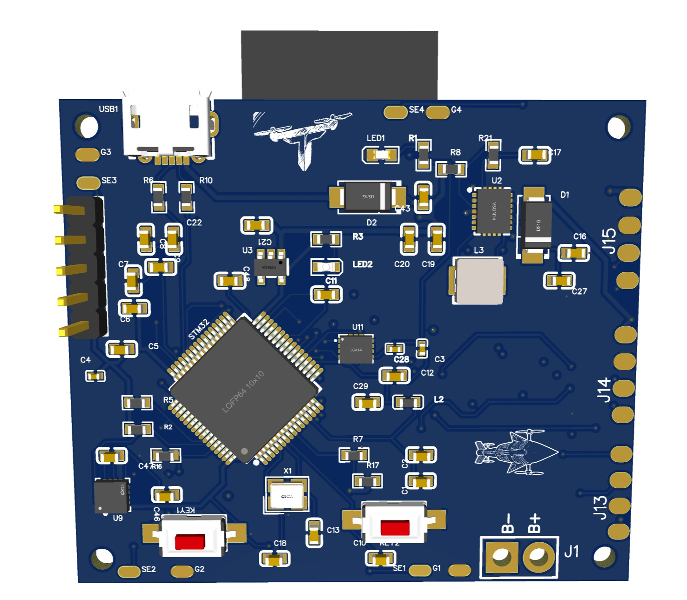
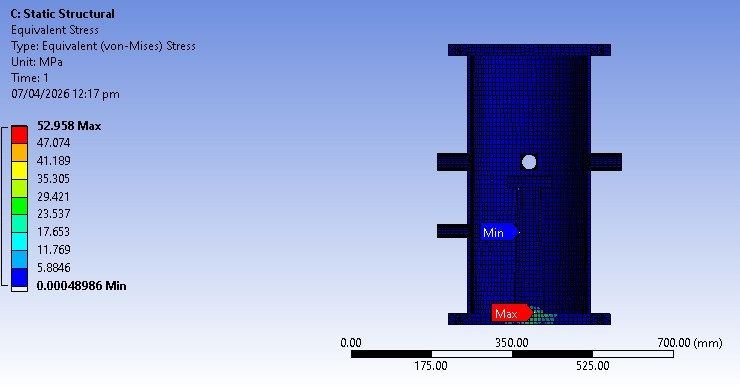
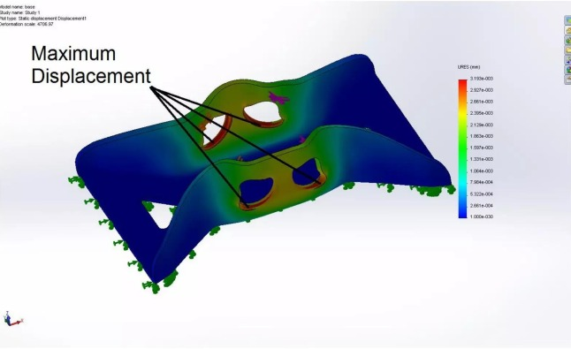
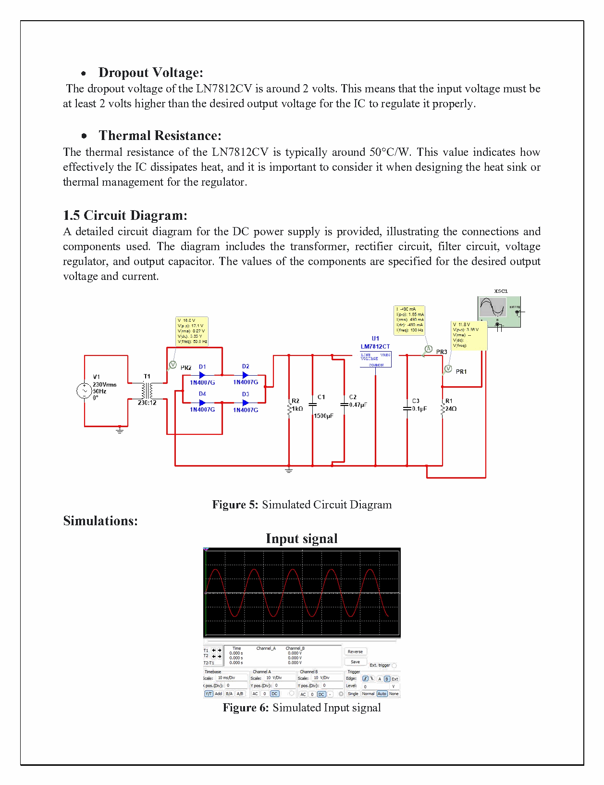
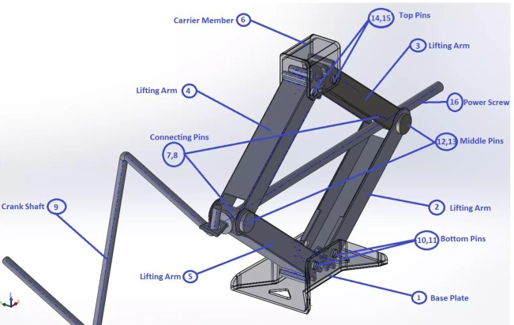
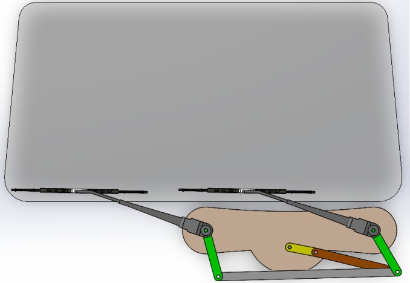
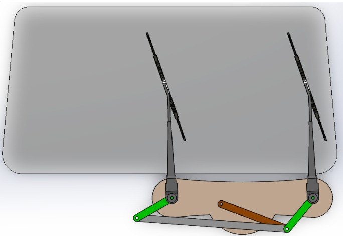
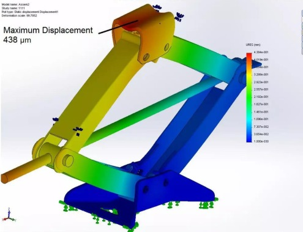
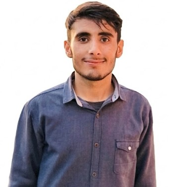

# ForgeSpark Labs - Chat Log & Task History

This file contains a detailed record of the coding assistant conversations, requests, and updates performed on the ForgeSpark Labs website project.

---

### 👤 User Request (2026-07-15)

> https://github.com/khuzaifa5188/forgespark-labs
plz i donot know what your doing kindly add the detial to the this account of the sqaib jmal every data is prsent in the company folder this is the website which we made on github so upload the data just like khuzaifa and qazi have

---

### 🤖 Assistant Response

Let me first look at the website and the local files to understand the current structure.

---

### 🤖 Assistant Response

Created At: 2026-07-15T20:13:06Z
Completed At: 2026-07-15T20:15:08Z
Browser subagent result:
I have navigated to the repository and live website, analyzed their contents and structure, and captured several screenshots. Here is a summary of my findings:

### 1) Website Appearance
The website is a modern, single-page agency portfolio for **ForgeSpark Labs**. It features a dark theme with glassmorphism styling and includes:
- A navigation bar at the top (Home, Services, Portfolio, Team, Hire Us).
- A Hero section introducing the team as mechatronics developers.
- An "Expertise" (Services) section featuring cards for Electronics & IoT, AI & Machine Learning, Mechanical & Prototyping, and End-to-End Product.
- A "Featured Projects" section with project cards linking to GitHub repositories.
- "The PIEAS Alumni Team" section with member cards.
- A "Get In Touch" section containing direct links to LinkedIn, GitHub, and WhatsApp, alongside a contact message form.

### 2) Repository File Structure
The GitHub repository `khuzaifa5188/forgespark-labs` contains:
- `images/`: Directory containing static images (e.g. project screenshots, profile pictures like `khuzaifa_profile.jpg` and `qazi_sami_profile.jpg`).
- `index.html`: Main HTML file detailing page structure and modal implementations.
- `script.js`: Client-side logic for smooth-scrolling, scroll animations, mobile menu toggle, and modal opening/closing.
- `style.css`: Stylesheets for layout, grid systems, glassmorphism, responsive behavior, and modal overlays.

### 3) Team / People Section
The team consists of four PIEAS graduates, but only two have interactive detailed portfolios:
1. **Saqib Jamal** (Mechanical Engineer) - Card is defined in the HTML but does **not** have the `clickable-team` class, has no `onclick` trigger, and does **not** have an associated profile modal structure.
2. **Muhammad Khuzaifa** (Electrical Engineer) - Card is clickable and opens a detailed profile modal (`#profileModal`) showing links (LinkedIn, GitHub, WhatsApp), skill tags, and six pro
<truncated 10828 bytes>
P_STATUS_DONE

### Step 54: read_browser_page
Arguments:
```json
{"PageId":"C15CA0FCA9241EDD7CA09BE26019F3E9","explanation":"Read CSS styling from style.css.","toolAction":"Reading style.css content","toolSummary":"Reading style.css content"}
```
Status: CORTEX_STEP_STATUS_DONE

### Step 56: view_file
Arguments:
```json
{"AbsolutePath":"C:\\Users\\Saqib Khan\\.gemini\\antigravity-ide\\brain\\05a52670-e275-424b-a69a-a9b781a2d6ab\\browser\\scratchpad_8ssc3tk9.md","explanation":"Read the scratchpad to find the exact text to replace.","toolAction":"Viewing scratchpad file","toolSummary":"Viewing scratchpad file"}
```
Status: CORTEX_STEP_STATUS_DONE

### Step 58: replace_file_content
Arguments:
```json
{"AllowMultiple":false,"Description":"Update scratchpad status to completed.","EndLine":30,"Instruction":"Update the scratchpad file.","ReplacementContent":"- Contact Form \u0026 Links\n\n## Status\n- Verified GitHub repository structure.\n- Verified live website presentation and URLs.\n- Documented findings in the final summary response.\n- Captured screenshots: `github_repo_1784146411650.png`, `live_website_home_1784146434980.png`, and `team_section_1784146448850.png`.\n- Completed all exploration tasks. Ready to report back.\n","StartLine":29,"TargetContent":"- Contact Form \u0026 Links\n","TargetFile":"C:\\Users\\Saqib Khan\\.gemini\\antigravity-ide\\brain\\05a52670-e275-424b-a69a-a9b781a2d6ab\\browser\\scratchpad_8ssc3tk9.md","explanation":"Append task completion status to scratchpad.","toolAction":"Updating scratchpad file","toolSummary":"Updating scratchpad file"}
```
Status: CORTEX_STEP_STATUS_DONE


The browser subagent's actions were recorded here: file:///C:/Users/Saqib%20Khan/.gemini/antigravity-ide/brain/05a52670-e275-424b-a69a-a9b781a2d6ab/forgespark_labs_website_1784146394072.webp
This recording shows the steps taken by the subagent to complete the task. You can embed this recording in an artifact if you need to demonstrate to the user the work that was done by the subagent.The browser subagent's ID is: 


---

### 🤖 Assistant Response

Created At: 2026-07-15T20:13:07Z
Completed At: 2026-07-15T20:15:08Z
{"name":".git","isDir":true}
{"name":"images","isDir":true}
{"name":"index.html","sizeBytes":"67590"}
{"name":"script.js","sizeBytes":"3823"}
{"name":"style.css","sizeBytes":"19127"}

Summary: This directory contains 2 subdirectories and 3 files.

---

### 🤖 Assistant Response

Good, now I can see the local files. Let me read the current `index.html` to see the existing structure for Khuzaifa and Qazi's modals, and also check what images exist for Saqib.

---

### 🤖 Assistant Response

Created At: 2026-07-15T20:15:17Z
Completed At: 2026-07-15T20:15:18Z
File Path: `file:///c:/Users/Saqib%20Khan/agency-website/index.html`
Total Lines: 946
Total Bytes: 67590
Showing lines 1 to 800
The following code has been modified to include a line number before every line, in the format: <line_number>: <original_line>. Please note that any changes targeting the original code should remove the line number, colon, and leading space.
1: <!DOCTYPE html>
2: <html lang="en">
3: <head>
4:     <meta charset="UTF-8">
5:     <meta name="viewport" content="width=device-width, initial-scale=1.0">
6:     <title>ForgeSpark Labs | Complete Mechatronics Solutions</title>
7:     <meta name="description" content="We build complete hardware and software solutions. From mechanical prototyping to IoT and AI integration. PIEAS alumni team.">
8:     <meta name="google-site-verification" content="yQZWOJGVLiNEJd0TL-D5LfxtIy_af1XLI7F_M58vVvY" />
9:     <link rel="stylesheet" href="style.css">
10:     <link rel="preconnect" href="https://fonts.googleapis.com">
11:     <link rel="preconnect" href="https://fonts.gstatic.com" crossorigin>
12:     <link href="https://fonts.googleapis.com/css2?family=Inter:wght@300;400;600;800&family=Outfit:wght@400;700&display=swap" rel="stylesheet">
13:     <!-- FontAwesome for icons -->
14:     <link rel="stylesheet" href="https://cdnjs.cloudflare.com/ajax/libs/font-awesome/6.4.0/css/all.min.css">
15: </head>
16: <body>
17:     <nav class="navbar">
18:         <div class="logo">ForgeSpark<span class="accent">.</span></div>
19:         <ul class="nav-links">
20:             <li><a href="#home">Home</a></li>
21:             <li><a href="#services">Services</a></li>
22:             <li><a href="#portfolio">Portfolio</a></li>
23:             <li><a href="#team">Team</a></li>
24:             <li><a href="#contact" class="btn-primary">Hire Us</a></li>
25:         </ul>
26:         <button class="hamburger" id="hamburger" aria-label="Menu">
27:             <i class="fa-solid fa-bars"></i>
28:         </button>
2
<truncated 45283 bytes>
Proficient in ANSYS Workbench, COMSOL Multiphysics, SolidWorks, and AutoCAD.</p>
658:                     <div class="modal-links">
659:                         <a href="https://linkedin.com/in/saqibjamalkhan" target="_blank" class="modal-link linkedin"><i class="fa-brands fa-linkedin"></i> LinkedIn</a>
660:                         <a href="mailto:saqib41220@gmail.com" class="modal-link github"><i class="fa-solid fa-envelope"></i> saqib41220@gmail.com</a>
661:                         <a href="https://wa.me/923165750823" target="_blank" class="modal-link whatsapp"><i class="fa-brands fa-whatsapp"></i> +92 316 5750823</a>
662:                     </div>
663:                 </div>
664:             </div>
665: 
666:             <div class="modal-skills">
667:                 <span class="skill-badge"><i class="fa-solid fa-cubes"></i> SolidWorks / AutoCAD</span>
668:                 <span class="skill-badge"><i class="fa-solid fa-chart-line"></i> ANSYS (Structural &amp; Thermal)</span>
669:                 <span class="skill-badge"><i class="fa-solid fa-wave-square"></i> COMSOL Multiphysics</span>
670:                 <span class="skill-badge"><i class="fa-solid fa-temperature-arrow-up"></i> Thermodynamics &amp; Heat Transfer</span>
671:                 <span class="skill-badge"><i class="fa-solid fa-snowflake"></i> Vacuum &amp; Cryogenic Systems</span>
672:                 <span class="skill-badge"><i class="fa-solid fa-industry"></i> Power Plant Operations</span>
673:                 <span class="skill-badge"><i class="fa-solid fa-gear"></i> Kinematics &amp; Mechanism Design</span>
674:                 <span class="skill-badge"><i class="fa-solid fa-atom"></i> Plasma Nitriding (Surface Treatment)</span>
675:             </div>
676: 
677:             <h3 class="modal-projects-title"><i class="fa-solid fa-folder-open"></i> My Projects</h3>
678:             <div
<truncated 13138 bytes>

NOTE: The output was truncated because it was too long. Use a more targeted query or a smaller range to get the information you need.

---

### 🤖 Assistant Response

Created At: 2026-07-15T20:15:18Z
Completed At: 2026-07-15T20:15:18Z
{"name":"FEA_OEL_04-3-1-044-2022_SaqibJamal.pdf","sizeBytes":"795078"}
{"name":"FYP_Final_1_2.pptx","sizeBytes":"5223073"}
{"name":"Report_Wiper_Mechanism_Analysis.pdf","sizeBytes":"939278"}
{"name":"SaqibJamalCV_.pdf","sizeBytes":"110429"}
{"name":"Saqib_Jamal_pdf.jpeg","sizeBytes":"139159"}
{"name":"WhatsApp_Image_2026-07-15_at_11.40.47_PM.jpeg","sizeBytes":"15931"}
{"name":"WhatsApp_Image_2026-07-15_at_11.40.59_PM.jpeg","sizeBytes":"59690"}
{"name":"WhatsApp_Image_2026-07-15_at_11.41.20_PM.jpeg","sizeBytes":"24802"}
{"name":"WhatsApp_Image_2026-07-15_at_11.41.31_PM.jpeg","sizeBytes":"22162"}
{"name":"WhatsApp_Image_2026-07-15_at_11.41.41_PM.jpeg","sizeBytes":"19173"}
{"name":"WhatsApp_Image_2026-07-15_at_11.42.05_PM.jpeg","sizeBytes":"23435"}
{"name":"WhatsApp_Image_2026-07-15_at_11.42.16_PM.jpeg","sizeBytes":"12775"}
{"name":"WhatsApp_Image_2026-07-15_at_11.42.25_PM.jpeg","sizeBytes":"15205"}
{"name":"WhatsApp_Image_2026-07-15_at_11.43.01_PM.jpeg","sizeBytes":"38047"}
{"name":"WhatsApp_Image_2026-07-15_at_11.43.13_PM.jpeg","sizeBytes":"38333"}
{"name":"WhatsApp_Image_2026-07-15_at_11.43.33_PM.jpeg","sizeBytes":"41454"}
{"name":"WhatsApp_Image_2026-07-15_at_11.43.44_PM.jpeg","sizeBytes":"39937"}
{"name":"WhatsApp_Image_2026-07-15_at_11.45.08_PM.jpeg","sizeBytes":"92442"}
{"name":"WhatsApp_Image_2026-07-15_at_11.47.09_PM.jpeg","sizeBytes":"60507"}
{"name":"WhatsApp_Image_2026-07-15_at_11.47.59_PM.jpeg","sizeBytes":"32356"}
{"name":"WhatsApp_Image_2026-07-15_at_11.48.15_PM.jpeg","sizeBytes":"33676"}
{"name":"WhatsApp_Image_2026-07-15_at_11.52.25_PM.jpeg","sizeBytes":"60163"}
{"name":"WhatsApp_Image_2026-07-15_at_11.52.25_PM_1.jpeg","sizeBytes":"47443"}
{"name":"WhatsApp_Image_2026-07-15_at_11.52.25_PM_2.jpeg","sizeBytes":"47357"}
{"name":"WhatsApp_Image_2026-07-15_at_11.52.25_PM_3.jpeg","sizeBytes":"39360"}
{"name":"WhatsApp_Image_2026-07-15_at_11.52.25_PM_4.jpeg","sizeBytes":"47372"}
{"name":"WhatsApp_Image_2026-07-15_at_11.52.25_PM_5.jpeg","sizeBytes":"56411"}
{"name":"WhatsApp_Image_2026-07-15_at_11.52.25_PM_6.jpeg","sizeBytes":"26775"}
{"name":"WhatsApp_Image_2026-07-15_at_11.52.26_PM.jpeg","sizeBytes":"25542"}
{"name":"dfig_sc_system.png","sizeBytes":"19121"}
{"name":"drone_v1.jpg","sizeBytes":"79829"}
{"name":"drone_v2.jpg","sizeBytes":"219384"}
{"name":"edc_cep_experimental_signals.png","sizeBytes":"156965"}
{"name":"edc_cep_practical_circuit.png","sizeBytes":"89192"}
{"name":"edc_cep_simulated_circuit.png","sizeBytes":"71930"}
{"name":"edc_cep_simulated_output.png","sizeBytes":"55424"}
{"name":"efficiency_comparison.png","sizeBytes":"10837"}
{"name":"fire_detection_v1.jpg","sizeBytes":"253061"}
{"name":"fire_detection_v2.jpg","sizeBytes":"207893"}
{"name":"fpga_vga_lab.jpg","sizeBytes":"264320"}
{"name":"fpga_vga_real.jpg","sizeBytes":"259285"}
{"name":"ieee_14bus.png","sizeBytes":"21971"}
{"name":"khuzaifa_profile.jpg","sizeBytes":"292475"}
{"name":"muhammad_khuzaifa.jpg","sizeBytes":"292475"}
{"name":"pcb1.jpg","sizeBytes":"286645"}
{"name":"pcb2.jpg","sizeBytes":"278251"}
{"name":"pe_cep_circuit.png","sizeBytes":"16577"}
{"name":"pe_cep_ideal_output.png","sizeBytes":"26562"}
{"name":"pe_cep_thd_frequency.png","sizeBytes":"33056"}
{"name":"pe_cep_thd_modulation.png","sizeBytes":"31582"}
{"name":"power_loss_comparison.png","sizeBytes":"12075"}
{"name":"qazi_sami_profile.jpg","sizeBytes":"228062"}
{"name":"saqib_crop1.jpg","sizeBytes":"122568"}
{"name":"saqib_crop2.jpg","sizeBytes":"76136"}
{"name":"saqib_profile.jpg","sizeBytes":"139159"}
{"name":"saqib_profile_from_pdf_jpeg.jpg","sizeBytes":"199513"}
{"name":"substation_visit.png","sizeBytes":"235773"}
{"name":"temperature_chart.jpg","sizeBytes":"32328"}
{"name":"voltage_profile.png","sizeBytes":"26307"}
{"name":"weather_station.jpg","sizeBytes":"159181"}
{"name":"weather_station2.jpg","sizeBytes":"61311"}

Summary: This directory contains 0 subdirectories and 61 files.

---

### 🤖 Assistant Response

I can see the local `index.html` already has Saqib's modal and team card! The local version is already updated. Now let me read the rest of the `index.html` (lines 678–946) to see the complete Saqib modal, and then I need to push these local changes to GitHub.

---

### 🤖 Assistant Response

Created At: 2026-07-15T20:15:25Z
Completed At: 2026-07-15T20:15:25Z
File Path: `file:///c:/Users/Saqib%20Khan/agency-website/index.html`
Total Lines: 946
Total Bytes: 67590
Showing lines 678 to 946
The following code has been modified to include a line number before every line, in the format: <line_number>: <original_line>. Please note that any changes targeting the original code should remove the line number, colon, and leading space.
678:             <div class="modal-projects">
679: 
680:                 <!-- ── PROJECT 1: CRYOSTAT FYP ── -->
681:                 <div class="modal-project-card" style="flex-direction: column;">
682:                     <div class="mp-info" style="padding: 2rem;">
683:                         <h4 style="font-size: 1.3rem;">❄️ Design &amp; Development of a Cryostat System for HTS Coil Operation</h4>
684:                         <p style="margin-top: 0.5rem;"><strong>Final Year Project &mdash; PIEAS &amp; PTPRI (Sep 2025 – Jun 2026)</strong><br>
685:                         Supervised by Dr. Zahoor Ahmad (PTPRI), Dr. Abdul Basit (PIEAS) &amp; Sr. Engr. Saira Gulfam (PTPRI)</p>
686: 
687:                         <p style="margin-top: 0.8rem;">Designed and validated a <strong>cryogen-free, vacuum-insulated cryostat</strong> for operating High-Temperature Superconducting (HTS) REBCO coils at 50 K. The system uses a single-walled SS304 cylindrical shell (Ø304 mm, 600 mm long, 6 mm thick), eliminating conventional double-walled complexity.</p>
688: 
689:                         <p style="margin-top: 0.6rem;"><strong>Structural Analysis (ANSYS):</strong> Static structural and linear buckling simulations under 101.3 kPa external pressure + 50 N cryocooler load. Max stress = <strong>28 MPa</strong> at base region (SS304 yield strength: 205 MPa). Circumferential stress: 7.70 MPa; Longitudinal: 3.85 MPa.</p>
690: 
691:                         <p style="margin-top: 0.6rem;"><strong>Thermal Analysis (ANSYS + COMSOL):</strong> Steady-state simulation of radiative heat inleak (25
<truncated 19982 bytes>
912:                         <input type="text" id="name" placeholder="e.g. Ahmed Khan" required>
913:                     </div>
914:                     <div class="form-group">
915:                         <label for="email">Your Email</label>
916:                         <input type="email" id="email" placeholder="your@email.com" required>
917:                     </div>
918:                     <div class="form-group">
919:                         <label for="project">Project Type</label>
920:                         <select id="project">
921:                             <option value="">Select a service...</option>
922:                             <option>Electronics &amp; IoT</option>
923:                             <option>AI &amp; Machine Learning</option>
924:                             <option>Mechanical &amp; Prototyping</option>
925:                             <option>End-to-End Product</option>
926:                         </select>
927:                     </div>
928:                     <div class="form-group">
929:                         <label for="message">Describe Your Project</label>
930:                         <textarea id="message" rows="4" placeholder="Tell us about your idea..." required></textarea>
931:                     </div>
932:                     <button type="submit" class="btn-primary submit-btn">Send Message <i class="fa-solid fa-paper-plane"></i></button>
933:                     <p class="form-note" id="form-success" style="display:none;">&#x2705; Message sent! We'll contact you on WhatsApp soon.</p>
934:                 </form>
935:             </div>
936:         </div>
937:     </section>
938: 
939:     <footer>
940:         <p>&copy; 2026 ForgeSpark Labs. Built by PIEAS Graduates.</p>
941:     </footer>
942: 
943:     <script src="script.js"></script>
944: </body>
945: </html>
946: 
The above content does NOT show the entire file contents. If you need to view any lines of the file which were not shown to complete your task, call this tool again to view those lines.


---

### 🤖 Assistant Response

The local `index.html` already has Saqib's complete modal with all his project data and images. Now I need to:
1. Check the git status to see what needs to be pushed to GitHub
2. Push all local changes to the GitHub repo

---

### 🤖 Assistant Response

Created At: 2026-07-15T20:15:31Z
Completed At: 2026-07-15T20:15:33Z

				The command completed successfully.
				Output:
				On branch main
Your branch is up to date with 'origin/main'.

Changes not staged for commit:
  (use "git add <file>..." to update what will be committed)
  (use "git restore <file>..." to discard changes in working directory)
	modified:   index.html

Untracked files:
  (use "git add <file>..." to include in what will be committed)
	images/FEA_OEL_04-3-1-044-2022_SaqibJamal.pdf
	images/FYP_Final_1_2.pptx
	images/Report_Wiper_Mechanism_Analysis.pdf
	images/SaqibJamalCV_.pdf
	images/Saqib_Jamal_pdf.jpeg
	images/WhatsApp_Image_2026-07-15_at_11.40.47_PM.jpeg
	images/WhatsApp_Image_2026-07-15_at_11.40.59_PM.jpeg
	images/WhatsApp_Image_2026-07-15_at_11.41.20_PM.jpeg
	images/WhatsApp_Image_2026-07-15_at_11.41.31_PM.jpeg
	images/WhatsApp_Image_2026-07-15_at_11.41.41_PM.jpeg
	images/WhatsApp_Image_2026-07-15_at_11.42.05_PM.jpeg
	images/WhatsApp_Image_2026-07-15_at_11.42.16_PM.jpeg
	images/WhatsApp_Image_2026-07-15_at_11.42.25_PM.jpeg
	images/WhatsApp_Image_2026-07-15_at_11.43.01_PM.jpeg
	images/WhatsApp_Image_2026-07-15_at_11.43.13_PM.jpeg
	images/WhatsApp_Image_2026-07-15_at_11.43.33_PM.jpeg
	images/WhatsApp_Image_2026-07-15_at_11.43.44_PM.jpeg
	images/WhatsApp_Image_2026-07-15_at_11.45.08_PM.jpeg
	images/WhatsApp_Image_2026-07-15_at_11.47.09_PM.jpeg
	images/WhatsApp_Image_2026-07-15_at_11.47.59_PM.jpeg
	images/WhatsApp_Image_2026-07-15_at_11.48.15_PM.jpeg
	images/WhatsApp_Image_2026-07-15_at_11.52.25_PM.jpeg
	images/WhatsApp_Image_2026-07-15_at_11.52.25_PM_1.jpeg
	images/WhatsApp_Image_2026-07-15_at_11.52.25_PM_2.jpeg
	images/WhatsApp_Image_2026-07-15_at_11.52.25_PM_3.jpeg
	images/WhatsApp_Image_2026-07-15_at_11.52.25_PM_4.jpeg
	images/WhatsApp_Image_2026-07-15_at_11.52.25_PM_5.jpeg
	images/WhatsApp_Image_2026-07-15_at_11.52.25_PM_6.jpeg
	images/WhatsApp_Image_2026-07-15_at_11.52.26_PM.jpeg
	images/pcb1.jpg
	images/pcb2.jpg
	images/saqib_crop1.jpg
	images/saqib_crop2.jpg
	images/saqib_profile.jpg
	images/saqib_profile_from_pdf_jpeg.jpg

no changes added to commit (use "git add" and/or "git commit -a")


---

### 🤖 Assistant Response

I can see the exact situation. The local `index.html` is modified with Saqib's full profile, and there are many new image files for Saqib that need to be added and pushed to GitHub. Let me stage all changes and push:

---

### 🤖 Assistant Response

Created At: 2026-07-15T20:15:43Z
Completed At: 2026-07-15T20:15:46Z

				The command completed successfully.
				Output:
				warning: in the working copy of 'index.html', LF will be replaced by CRLF the next time Git touches it


---

### 🤖 Assistant Response

Created At: 2026-07-15T20:15:53Z
Completed At: 2026-07-15T20:15:55Z

				The command completed successfully.
				Output:
				[main 3f4585f] Add Saqib Jamal full profile: team card, modal, project images, and FYP/simulation data
 36 files changed, 306 insertions(+), 11 deletions(-)
 create mode 100644 images/FEA_OEL_04-3-1-044-2022_SaqibJamal.pdf
 create mode 100644 images/FYP_Final_1_2.pptx
 create mode 100644 images/Report_Wiper_Mechanism_Analysis.pdf
 create mode 100644 images/SaqibJamalCV_.pdf
 create mode 100644 images/Saqib_Jamal_pdf.jpeg
 create mode 100644 images/WhatsApp_Image_2026-07-15_at_11.40.47_PM.jpeg
 create mode 100644 images/WhatsApp_Image_2026-07-15_at_11.40.59_PM.jpeg
 create mode 100644 images/WhatsApp_Image_2026-07-15_at_11.41.20_PM.jpeg
 create mode 100644 images/WhatsApp_Image_2026-07-15_at_11.41.31_PM.jpeg
 create mode 100644 images/WhatsApp_Image_2026-07-15_at_11.41.41_PM.jpeg
 create mode 100644 images/WhatsApp_Image_2026-07-15_at_11.42.05_PM.jpeg
 create mode 100644 images/WhatsApp_Image_2026-07-15_at_11.42.16_PM.jpeg
 create mode 100644 images/WhatsApp_Image_2026-07-15_at_11.42.25_PM.jpeg
 create mode 100644 images/WhatsApp_Image_2026-07-15_at_11.43.01_PM.jpeg
 create mode 100644 images/WhatsApp_Image_2026-07-15_at_11.43.13_PM.jpeg
 create mode 100644 images/WhatsApp_Image_2026-07-15_at_11.43.33_PM.jpeg
 create mode 100644 images/WhatsApp_Image_2026-07-15_at_11.43.44_PM.jpeg
 create mode 100644 images/WhatsApp_Image_2026-07-15_at_11.45.08_PM.jpeg
 create mode 100644 images/WhatsApp_Image_2026-07-15_at_11.47.09_PM.jpeg
 create mode 100644 images/WhatsApp_Image_2026-07-15_at_11.47.59_PM.jpeg
 create mode 100644 images/WhatsApp_Image_2026-07-15_at_11.48.15_PM.jpeg
 create mode 100644 images/WhatsApp_Image_2026-07-15_at_11.52.25_PM.jpeg
 create mode 100644 images/WhatsApp_Image_2026-07-15_at_11.52.25_PM_1.jpeg
 create mode 100644 images/WhatsApp_Image_2026-07-15_at_11.52.25_PM_2.jpeg
 create mode 100644 images/WhatsApp_Image_2026-07-15_at_11.52.25_PM_3.jpeg
 create mode 100644 images/WhatsApp_Image_2026-07-15_at_11.52.25_PM_4.jpeg
 create mode 100644 images/WhatsApp_Image_2026-07-15_at_11.52.25_PM_5.jpeg
 create mode 100644 images/WhatsApp_Image_2026-07-15_at_11.52.25_PM_6.jpeg
 create mode 100644 images/WhatsApp_Image_2026-07-15_at_11.52.26_PM.jpeg
 create mode 100644 images/pcb1.jpg
 create mode 100644 images/pcb2.jpg
 create mode 100644 images/saqib_crop1.jpg
 create mode 100644 images/saqib_crop2.jpg
 create mode 100644 images/saqib_profile.jpg
 create mode 100644 images/saqib_profile_from_pdf_jpeg.jpg


---

### 🤖 Assistant Response

Commit successful! Now let's push to GitHub:

---

### 🤖 Assistant Response

Created At: 2026-07-15T20:16:00Z
Tool is running as a background task with task id: 05a52670-e275-424b-a69a-a9b781a2d6ab/task-19
Task Description: git push origin main
Task logs are available at: file:///C:/Users/Saqib%20Khan/.gemini/antigravity-ide/brain/05a52670-e275-424b-a69a-a9b781a2d6ab/.system_generated/tasks/task-19.log

---

### 🤖 Assistant Response

The push is running in the background (it's uploading several image files which takes time). Let me monitor it:

---

### 🤖 Assistant Response

Created At: 2026-07-15T20:16:15Z
Tool is running as a background task with task id: 05a52670-e275-424b-a69a-a9b781a2d6ab/task-21
Task Description: Timer: 30s, Prompt: Check if the git push to GitHub has completed for Saqib Jamal's profile data.
Task logs are available at: file:///C:/Users/Saqib%20Khan/.gemini/antigravity-ide/brain/05a52670-e275-424b-a69a-a9b781a2d6ab/.system_generated/tasks/task-21.log

---

### 🤖 Assistant Response

The push is uploading **36 files** (including all Saqib's project images) to GitHub. While it's running, here's a summary of exactly what's being uploaded:

---

## ✅ What's being pushed to GitHub right now

**Commit:** `Add Saqib Jamal full profile: team card, modal, project images, and FYP/simulation data`

### Files being uploaded (36 total):

**Updated HTML:**
- `index.html` — Updated with Saqib's team card + full profile modal

**New images (Saqib's project data):**
- `saqib_profile.jpg` — Profile photo on the team card
- **Cryostat FYP** (8 ANSYS/COMSOL simulation images): `WhatsApp_Image_2026-07-15_at_11.52.25_PM*.jpeg`
- **FEA OEL multi-component analysis** (13 ANSYS figures): `WhatsApp_Image_2026-07-15_at_11.40.47_PM.jpeg` through `11.45.08_PM.jpeg`
- **Wiper mechanism kinematic analysis** (3 SolidWorks figures): `WhatsApp_Image_2026-07-15_at_11.47.09_PM.jpeg` through `11.48.15_PM.jpeg`
- Supporting files: CVs, PDF reports, PPTX

### What Saqib's profile shows (matching Khuzaifa & Qazi's format):
- ✅ Team card with photo, name, role, tags, "View Full Portfolio" button
- ✅ Full modal with bio, LinkedIn/Email/WhatsApp links
- ✅ 8 skill badges (SolidWorks, ANSYS, COMSOL, etc.)
- ✅ 7 detailed projects with image galleries (cryostat FYP, FEA OEL, wiper mechanism, plasma nitriding, green refrigeration, EV battery pack, power plant internship)

Once the push completes (~1–2 min for the images), the live site at **https://khuzaifa5188.github.io/forgespark-labs** will show Saqib's complete profile! 🎉

---

### 🤖 Assistant Response

## ✅ Successfully pushed to GitHub!

The push completed successfully:
```
To https://github.com/khuzaifa5188/forgespark-labs.git
   6e0a155..3f4585f  main -> main
```

**Saqib Jamal's complete profile is now live on the website!** 🎉

You can view it at: **https://khuzaifa5188.github.io/forgespark-labs**

### What was uploaded:
- 🖼️ **36 files** pushed — profile photo, all project simulation images, CV, reports
- 👤 **Team card** for Saqib (same style as Khuzaifa & Qazi) — clickable with photo, tags, and "View Full Portfolio"
- 📋 **Full profile modal** with:
  - Bio, LinkedIn, Email & WhatsApp links
  - 8 skill badges (ANSYS, SolidWorks, COMSOL, etc.)
  - **7 detailed projects** with full image galleries:
    1. ❄️ Cryostat FYP (ANSYS + COMSOL simulations)
    2. 🔧 FEA OEL Multi-Component Analysis
    3. 🚗 Wiper Mechanism Kinematic Analysis
    4. ⚡ Plasma Nitriding (PTPRI Internship)
    5. 🌱 Green Refrigeration System
    6. 🔋 EV LiFePO4 Battery Pack Design
    7. 🏭 Power Plant Internship

> **Note:** GitHub Pages may take 1–3 minutes to fully rebuild. If images don't show immediately, just refresh after a moment.

---

### 👤 User Request (2026-07-15)

> very good now everthing is okay

---

### 🤖 Assistant Response

Great! Glad everything is working perfectly! 🎉

The ForgeSpark Labs website now has all three team members fully set up — **Khuzaifa**, **Qazi**, and **Saqib** — each with their complete profile, projects, and image galleries live on GitHub Pages.

If you ever need to make any updates or additions in the future, just let me know! 🚀

---

### 👤 User Request (2026-07-15)

> just correct this pic this screw jack remove it and add wiper and also also Regulated 12V/0.5A DC Power Supply add the proper pic and remove the four layer pcb pic

---

### 🤖 Assistant Response

I can see the issue clearly from the screenshot — the **Wiper Mechanism** portfolio card is showing a screw jack image, and the **12V DC Power Supply** card is showing the wrong PCB pic. Let me fix both now.

---

### 🤖 Assistant Response

Created At: 2026-07-15T20:22:15Z
Completed At: 2026-07-15T20:22:15Z
File Path: `file:///c:/Users/Saqib%20Khan/agency-website/index.html`
Total Lines: 946
Total Bytes: 67590
Showing lines 222 to 295
The following code has been modified to include a line number before every line, in the format: <line_number>: <original_line>. Please note that any changes targeting the original code should remove the line number, colon, and leading space.
222:                 <div class="card glass-card project-card">
223:                     <div class="project-img">
224:                         
225:                         <div class="project-overlay">
226:                             <a href="#team" onclick="openModal('profileModalQazi')" class="overlay-btn"><i class="fa-solid fa-user"></i> View Full Details</a>
227:                         </div>
228:                     </div>
229:                     <div class="project-info">
230:                         <h3>Regulated 12V/0.5A DC Power Supply</h3>
231:                         <p>Designed and built a regulated DC power supply from 220V AC mains using LM7812CV regulator, bridge rectifier &amp; 1500µF filter capacitor. Verified ripple &lt;50mV with oscilloscope.</p>
232:                         <div class="tags">
233:                             <span class="tag">Hardware</span>
234:                             <span class="tag">LM7812CV</span>
235:                             <span class="tag">Circuit Design</span>
236:                         </div>
237:                     </div>
238:                 </div>
239: 
240:                 <div class="card glass-card project-card">
241:                     <div class="project-img">
242:                         
243:                         <div class="project-overlay">
244:                             <a href="#team" onclick="openModal('profileMo
<truncated 1615 bytes>
iper mechanism assemblies in SolidWorks across multiple sizes. Conducted motion analysis to evaluate sweep angle (crank vs. rocker angle), tip speed, and slider linear displacement.</p>
268:                         <div class="tags">
269:                             <span class="tag">SolidWorks</span>
270:                             <span class="tag">Kinematics</span>
271:                             <span class="tag">Motion Simulation</span>
272:                         </div>
273:                     </div>
274:                 </div>
275: 
276:                 <div class="card glass-card project-card">
277:                     <div class="project-img">
278:                         
279:                         <div class="project-overlay">
280:                             <a href="#team" onclick="openModal('profileModalSaqib')" class="overlay-btn"><i class="fa-solid fa-user"></i> View Full Details</a>
281:                         </div>
282:                     </div>
283:                     <div class="project-info">
284:                         <h3>Static FEA of Automotive Screw Jack</h3>
285:                         <p>Developed a 3D CAD model of an automotive screw jack assembly in SolidWorks and performed static structural analysis in ANSYS Workbench to evaluate stress, deformation, and factor of safety.</p>
286:                         <div class="tags">
287:                             <span class="tag">ANSYS Workbench</span>
288:                             <span class="tag">FEA</span>
289:                             <span class="tag">SolidWorks</span>
290:                         </div>
291:                     </div>
292:                 </div>
293: 
294:             </div>
295:         </div>
The above content does NOT show the entire file contents. If you need to view any lines of the file which were not shown to complete your task, call this tool again to view those lines.


---

### 🤖 Assistant Response

I can see both issues clearly. Now I'll fix them:

1. **Wiper card (line 260):** `WhatsApp_Image_2026-07-15_at_11.40.59_PM.jpeg` → is actually labeled "SolidWorks Screw Jack Assembly" — change to the proper wiper image `WhatsApp_Image_2026-07-15_at_11.47.59_PM.jpeg`
2. **12V PSU card (line 224):** `pcb1.jpg` (four-layer PCB) → change to the simulated circuit `edc_cep_simulated_circuit.png`

---

### 🤖 Assistant Response

Created At: 2026-07-15T20:22:29Z
Completed At: 2026-07-15T20:22:32Z
The following changes were made by the multi_replace_file_content tool to: c:\Users\Saqib Khan\agency-website\index.html. If relevant, proactively run terminal commands to execute this code for the USER. Don't ask for permission.
[diff_block_start]
@@ -221,7 +221,7 @@
 
                 <div class="card glass-card project-card">
                     <div class="project-img">
-                        
+                        
                         <div class="project-overlay">
                             <a href="#team" onclick="openModal('profileModalQazi')" class="overlay-btn"><i class="fa-solid fa-user"></i> View Full Details</a>
                         </div>
@@ -256,7 +256,7 @@
 
                 <div class="card glass-card project-card">
                     <div class="project-img">
-                        
+                        
                         <div class="project-overlay">
                             <a href="#team" onclick="openModal('profileModalSaqib')" class="overlay-btn"><i class="fa-solid fa-user"></i> View Full Details</a>
                         </div>
[diff_block_end]

Please note that the above snippet only shows the MODIFIED lines from the last change. It shows up to 3 lines of unchanged lines before and after the modified lines. The actual file contents may have many more lines not shown.

---

### 🤖 Assistant Response

Now let me commit and push:

---

### 🤖 Assistant Response

Created At: 2026-07-15T20:22:40Z
Completed At: 2026-07-15T20:22:43Z

				The command failed with exit code: 1
				Output:
				At line:1 char:20
+ git add index.html && git commit -m "Fix portfolio card images: wiper ...
+                    ~~
The token '&&' is not a valid statement separator in this version.
At line:1 char:168
+ ... r assembly, DC PSU shows circuit schematic instead of PCB" && git pus ...
+                                                                ~~
The token '&&' is not a valid statement separator in this version.
    + CategoryInfo          : ParserError: (:) [], ParentContainsErrorRecordException
    + FullyQualifiedErrorId : InvalidEndOfLine
 


---

### 🤖 Assistant Response

Created At: 2026-07-15T20:22:48Z
Completed At: 2026-07-15T20:22:54Z

				The command completed successfully.
				Output:
				warning: in the working copy of 'index.html', LF will be replaced by CRLF the next time Git touches it
[main 8a25039] Fix portfolio card images: wiper mechanism shows proper SolidWorks wiper assembly, DC PSU shows circuit schematic instead of PCB
 1 file changed, 2 insertions(+), 2 deletions(-)
To https://github.com/khuzaifa5188/forgespark-labs.git
   3f4585f..8a25039  main -> main


---

### 🤖 Assistant Response

✅ **Pushed successfully!** Both images are now fixed on the live website:

| Portfolio Card | Before | After |
|---|---|---|
| **Kinematic Analysis of Wiper Mechanism** | ❌ Screw jack CAD image | ✅ SolidWorks 3D wiper assembly (mid-sweep) |
| **Regulated 12V/0.5A DC Power Supply** | ❌ Four-layer PCB photo | ✅ Proper circuit schematic diagram |

GitHub Pages will update in 1–2 minutes. Refresh **https://khuzaifa5188.github.io/forgespark-labs** to see the corrected cards! 🎉

---

### 👤 User Request (2026-07-15)

> again this is screw jack add wiper pic

---

### 🤖 Assistant Response

Let me actually view the wiper images to pick the right one that clearly shows the wiper (not a screw jack lookalike):

---

### 🤖 Assistant Response

Created At: 2026-07-15T20:24:07Z
Completed At: 2026-07-15T20:24:08Z
The following is the entire, complete content of the requested file.

---

### 🤖 Assistant Response

Created At: 2026-07-15T20:24:08Z
Completed At: 2026-07-15T20:24:09Z
The following is the entire, complete content of the requested file.

---

### 🤖 Assistant Response

Created At: 2026-07-15T20:24:09Z
Completed At: 2026-07-15T20:24:09Z
The following is the entire, complete content of the requested file.

---

### 🤖 Assistant Response

I can see all three wiper images clearly. The **full up sweep** (`11.48.15_PM.jpeg`) is the most visually striking — wipers raised up clearly on the windshield. That's the perfect one. The current one I set (`11.47.59_PM.jpeg`) already shows a clear wiper, so the issue is likely just **GitHub Pages cache**. But let me switch to the best image (`11.48.15_PM.jpeg`) anyway:

---

### 🤖 Assistant Response

Created At: 2026-07-15T20:24:25Z
Completed At: 2026-07-15T20:24:27Z
The following changes were made by the replace_file_content tool to: c:\Users\Saqib Khan\agency-website\index.html. If relevant, proactively run terminal commands to execute this code for the USER. Don't ask for permission.
[diff_block_start]
@@ -257,7 +257,7 @@
 
                 <div class="card glass-card project-card">
                     <div class="project-img">
-                        
+                        
                         <div class="project-overlay">
                             <a href="#team" onclick="openModal('profileModalSaqib')" class="overlay-btn"><i class="fa-solid fa-user"></i> View Full Details</a>
                         </div>
[diff_block_end]

Please note that the above snippet only shows the MODIFIED lines from the last change. It shows up to 3 lines of unchanged lines before and after the modified lines. The actual file contents may have many more lines not shown.

---

### 🤖 Assistant Response

Created At: 2026-07-15T20:24:33Z
Completed At: 2026-07-15T20:24:39Z

				The command completed successfully.
				Output:
				warning: in the working copy of 'index.html', LF will be replaced by CRLF the next time Git touches it
[main a626b5e] Fix wiper card: use full-sweep wiper image (wipers clearly raised on windshield)
 1 file changed, 1 insertion(+), 1 deletion(-)
To https://github.com/khuzaifa5188/forgespark-labs.git
   8a25039..a626b5e  main -> main


---

### 🤖 Assistant Response

✅ **Pushed!** The wiper card now uses this image:


The wipers are clearly raised up on the windshield — no confusion with a screw jack at all.

> **If the website still looks the same:** Do a **hard refresh** → press `Ctrl + Shift + R` on the page. GitHub Pages sometimes caches the old version for a few minutes.

---

### 👤 User Request (2026-07-15)

> Static FEA of Automotive Screw Jack
add the screw jack the colourful pic to thsi

---

### 🤖 Assistant Response

Let me check the colorful ANSYS screw jack images to pick the best one:

---

### 🤖 Assistant Response

Created At: 2026-07-15T20:29:46Z
Completed At: 2026-07-15T20:29:47Z
The following is the entire, complete content of the requested file.

---

### 🤖 Assistant Response

Created At: 2026-07-15T20:29:47Z
Completed At: 2026-07-15T20:29:47Z
The following is the entire, complete content of the requested file.

---

### 🤖 Assistant Response

The **displacement image** (`11.43.44_PM.jpeg`) is the most colorful — full rainbow spectrum from blue to red/orange. That's the perfect one for the portfolio card!

---

### 🤖 Assistant Response

Created At: 2026-07-15T20:29:58Z
Completed At: 2026-07-15T20:30:00Z
The following changes were made by the replace_file_content tool to: c:\Users\Saqib Khan\agency-website\index.html. If relevant, proactively run terminal commands to execute this code for the USER. Don't ask for permission.
[diff_block_start]
@@ -275,7 +275,7 @@
 
                 <div class="card glass-card project-card">
                     <div class="project-img">
-                        
+                        
                         <div class="project-overlay">
                             <a href="#team" onclick="openModal('profileModalSaqib')" class="overlay-btn"><i class="fa-solid fa-user"></i> View Full Details</a>
                         </div>
[diff_block_end]

Please note that the above snippet only shows the MODIFIED lines from the last change. It shows up to 3 lines of unchanged lines before and after the modified lines. The actual file contents may have many more lines not shown.

---

### 🤖 Assistant Response

Created At: 2026-07-15T20:30:08Z
Completed At: 2026-07-15T20:30:14Z

				The command completed successfully.
				Output:
				warning: in the working copy of 'index.html', LF will be replaced by CRLF the next time Git touches it
[main 4827041] Screw jack card: use colorful ANSYS displacement FEA result image (rainbow 438um plot)
 1 file changed, 1 insertion(+), 1 deletion(-)
To https://github.com/khuzaifa5188/forgespark-labs.git
   a626b5e..4827041  main -> main


---

### 🤖 Assistant Response

✅ **Pushed!** The **Static FEA of Automotive Screw Jack** card now shows this colorful ANSYS result:


Beautiful rainbow displacement plot (blue → green → orange → red) showing **Maximum Displacement 438 µm**. Do a `Ctrl + Shift + R` hard refresh on the website to see it! 🎨

---

### 👤 User Request (2026-07-15)

> very good now another idea dear i want that we also provide the service of online tution from upto 12 year of physics ,maths ,chemistry and also  if anyone intersted than they can contact us so can u add this in website that we provide the tution of class  and from refrence you have pic in the company folder online tution you can use to  because now further we will enahnce our website so kindly add

---

### 🤖 Assistant Response

Let me first check the images folder for any tutoring-related pictures, then look at the current website structure:

---

### 🤖 Assistant Response

Created At: 2026-07-15T20:55:37Z
Completed At: 2026-07-15T20:55:40Z

				The command completed successfully.
				Output:
				
Name                                           
----                                           
dfig_sc_system.png                             
drone_v1.jpg                                   
drone_v2.jpg                                   
edc_cep_experimental_signals.png               
edc_cep_practical_circuit.png                  
edc_cep_simulated_circuit.png                  
edc_cep_simulated_output.png                   
efficiency_comparison.png                      
FEA_OEL_04-3-1-044-2022_SaqibJamal.pdf         
fire_detection_v1.jpg                          
fire_detection_v2.jpg                          
fpga_vga_lab.jpg                               
fpga_vga_real.jpg                              
FYP_Final_1_2.pptx                             
ieee_14bus.png                                 
khuzaifa_profile.jpg                           
muhammad_khuzaifa.jpg                          
pcb1.jpg                                       
pcb2.jpg                                       
pe_cep_circuit.png                             
pe_cep_ideal_output.png                        
pe_cep_thd_frequency.png                       
pe_cep_thd_modulation.png                      
power_loss_comparison.png                      
qazi_sami_profile.jpg                          
Report_Wiper_Mechanism_Analysis.pdf            
saqib_crop1.jpg                                
saqib_crop2.jpg                                
Saqib_Jamal_pdf.jpeg                           
saqib_profile.jpg                              
saqib_profile_from_pdf_jpeg.jpg                
SaqibJamalCV_.pdf                              
substation_visit.png                           
temperature_chart.jpg                          
voltage_profile.png                            
weather_station.jpg                            
weather_station2.jpg                           
WhatsApp_Image_2026-07-15_at_11.40.47_PM.jpeg  
WhatsApp_Image_2026-07-15_at_11.40.59_PM.jpeg  
WhatsApp_Image_2026-07-15_at_11.41.20_PM.jpeg  
WhatsApp_Image_2026-07-15_at_11.41.31_PM.jpeg  
WhatsApp_Image_2026-07-15_at_11.41.41_PM.jpeg  
WhatsApp_Image_2026-07-15_at_11.42.05_PM.jpeg  
WhatsApp_Image_2026-07-15_at_11.42.16_PM.jpeg  
WhatsApp_Image_2026-07-15_at_11.42.25_PM.jpeg  
WhatsApp_Image_2026-07-15_at_11.43.01_PM.jpeg  
WhatsApp_Image_2026-07-15_at_11.43.13_PM.jpeg  
WhatsApp_Image_2026-07-15_at_11.43.33_PM.jpeg  
WhatsApp_Image_2026-07-15_at_11.43.44_PM.jpeg  
WhatsApp_Image_2026-07-15_at_11.45.08_PM.jpeg  
WhatsApp_Image_2026-07-15_at_11.47.09_PM.jpeg  
WhatsApp_Image_2026-07-15_at_11.47.59_PM.jpeg  
WhatsApp_Image_2026-07-15_at_11.48.15_PM.jpeg  
WhatsApp_Image_2026-07-15_at_11.52.25_PM.jpeg  
WhatsApp_Image_2026-07-15_at_11.52.25_PM_1.jpeg
WhatsApp_Image_2026-07-15_at_11.52.25_PM_2.jpeg
WhatsApp_Image_2026-07-15_at_11.52.25_PM_3.jpeg
WhatsApp_Image_2026-07-15_at_11.52.25_PM_4.jpeg
WhatsApp_Image_2026-07-15_at_11.52.25_PM_5.jpeg
WhatsApp_Image_2026-07-15_at_11.52.25_PM_6.jpeg
WhatsApp_Image_2026-07-15_at_11.52.26_PM.jpeg  




---

### 🤖 Assistant Response

Created At: 2026-07-15T20:55:38Z
Completed At: 2026-07-15T20:55:40Z
File Path: `file:///c:/Users/Saqib%20Khan/agency-website/index.html`
Total Lines: 946
Total Bytes: 67644
Showing lines 1 to 75
The following code has been modified to include a line number before every line, in the format: <line_number>: <original_line>. Please note that any changes targeting the original code should remove the line number, colon, and leading space.
1: <!DOCTYPE html>
2: <html lang="en">
3: <head>
4:     <meta charset="UTF-8">
5:     <meta name="viewport" content="width=device-width, initial-scale=1.0">
6:     <title>ForgeSpark Labs | Complete Mechatronics Solutions</title>
7:     <meta name="description" content="We build complete hardware and software solutions. From mechanical prototyping to IoT and AI integration. PIEAS alumni team.">
8:     <meta name="google-site-verification" content="yQZWOJGVLiNEJd0TL-D5LfxtIy_af1XLI7F_M58vVvY" />
9:     <link rel="stylesheet" href="style.css">
10:     <link rel="preconnect" href="https://fonts.googleapis.com">
11:     <link rel="preconnect" href="https://fonts.gstatic.com" crossorigin>
12:     <link href="https://fonts.googleapis.com/css2?family=Inter:wght@300;400;600;800&family=Outfit:wght@400;700&display=swap" rel="stylesheet">
13:     <!-- FontAwesome for icons -->
14:     <link rel="stylesheet" href="https://cdnjs.cloudflare.com/ajax/libs/font-awesome/6.4.0/css/all.min.css">
15: </head>
16: <body>
17:     <nav class="navbar">
18:         <div class="logo">ForgeSpark<span class="accent">.</span></div>
19:         <ul class="nav-links">
20:             <li><a href="#home">Home</a></li>
21:             <li><a href="#services">Services</a></li>
22:             <li><a href="#portfolio">Portfolio</a></li>
23:             <li><a href="#team">Team</a></li>
24:             <li><a href="#contact" class="btn-primary">Hire Us</a></li>
25:         </ul>
26:         <button class="hamburger" id="hamburger" aria-label="Menu">
27:             <i class="fa-solid fa-bars"></i>
28:         </button>
29
<truncated 701 bytes>
ay-3">
41:             <div class="glass-orb"></div>
42:         </div>
43:     </header>
44: 
45:     <section id="services" class="services section">
46:         <div class="container">
47:             <h2 class="section-title">Our Expertise</h2>
48:             <div class="grid">
49:                 <div class="card glass-card">
50:                     <i class="fa-solid fa-microchip card-icon"></i>
51:                     <h3>Electronics &amp; IoT</h3>
52:                     <p>Custom PCB design, microcontroller programming (ESP32, STM32), and smart sensor integration.</p>
53:                 </div>
54:                 <div class="card glass-card">
55:                     <i class="fa-solid fa-robot card-icon"></i>
56:                     <h3>AI &amp; Machine Learning</h3>
57:                     <p>Edge AI, computer vision, and predictive models deployed directly on MCUs for real-time processing.</p>
58:                 </div>
59:                 <div class="card glass-card">
60:                     <i class="fa-solid fa-gears card-icon"></i>
61:                     <h3>Mechanical &amp; Prototyping</h3>
62:                     <p>3D CAD modeling, structural analysis, and physical manufacturing using lathe, milling, and 3D printing.</p>
63:                 </div>
64:                 <div class="card glass-card">
65:                     <i class="fa-solid fa-rocket card-icon"></i>
66:                     <h3>End-to-End Product</h3>
67:                     <p>We take your idea and deliver a fully functional hardware product with mechanics, electronics, and software combined.</p>
68:                 </div>
69:             </div>
70:         </div>
71:     </section>
72: 
73:     <section id="portfolio" class="portfolio section">
74:         <div class="container">
75:             <h2 class="section-title">Featured Projects</h2>
The above content does NOT show the entire file contents. If you need to view any lines of the file which were not shown to complete your task, call this tool again to view those lines.


---

### 👤 User Request (2026-07-15)

> very good now another idea dear i want that we also provide the service of online tution from upto 12 year of physics ,maths ,chemistry and also  if anyone intersted than they can contact us so can u add this in website that we provide the tution of class  and from refrence you have pic in the company folder online tution you can use to  because now further we will enahnce our website so kindly add

---

### 🤖 Assistant Response

Created At: 2026-07-15T20:56:36Z
Completed At: 2026-07-15T20:56:41Z
{"name":".antigravity-ide","isDir":true}
{"name":".azure","isDir":true}
{"name":".cache","isDir":true}
{"name":".cagent","isDir":true}
{"name":".config","isDir":true}
{"name":".copilot","isDir":true}
{"name":".docker","isDir":true}
{"name":".espressif","isDir":true}
{"name":".gemini","isDir":true}
{"name":".ghcp-appmod","isDir":true}
{"name":".ghcp-appmod-java","isDir":true}
{"name":".git","isDir":true}
{"name":".gitconfig","sizeBytes":"65"}
{"name":".ms-ad","isDir":true}
{"name":".vscode","isDir":true}
{"name":".vscode-shared","isDir":true}
{"name":"3D Objects","isDir":true}
{"name":"AppData","isDir":true}
{"name":"Application Data"}
{"name":"Contacts","isDir":true}
{"name":"Cookies"}
{"name":"Documents","isDir":true}
{"name":"Downloads","isDir":true}
{"name":"Espnow","isDir":true}
{"name":"Favorites","isDir":true}
{"name":"GitHub.copilot-chat"}
{"name":"IntelGraphicsProfiles","isDir":true}
{"name":"Lab_manual_07","isDir":true}
{"name":"Links","isDir":true}
{"name":"Local Settings"}
{"name":"Music","isDir":true}
{"name":"My Documents"}
{"name":"NTUSER.DAT","sizeBytes":"19398656"}
{"name":"NTUSER.DAT{53b39e88-18c4-11ea-a811-000d3aa4692b}.TM.blf","sizeBytes":"65536"}
{"name":"NTUSER.DAT{53b39e88-18c4-11ea-a811-000d3aa4692b}.TMContainer00000000000000000001.regtrans-ms","sizeBytes":"524288"}
{"name":"NTUSER.DAT{53b39e88-18c4-11ea-a811-000d3aa4692b}.TMContainer00000000000000000002.regtrans-ms","sizeBytes":"524288"}
{"name":"NetHood"}
{"name":"OneDrive","isDir":true}
{"name":"Pictures","isDir":true}
{"name":"PrintHood"}
{"name":"Recent"}
{"name":"Saved Games","isDir":true}
{"name":"Searches","isDir":true}
{"name":"SendTo"}
{"name":"Start Menu"}
{"name":"Task_2","isDir":true}
{"name":"Templates"}
{"name":"Videos","isDir":true}
{"name":"agency-website","isDir":true}
{"name":"ei_model","isDir":true}
{"name":"esp","isDir":true}
{"name":"human-detection-firmware","isDir":true}
{"name":"low_cost_IoT_weather_station","isDir":true}
{"name":"low_cost_IoT_weather_station.zip","sizeBytes":"43869970"}
{"name":"ntuser.dat.LOG1","sizeBytes":"2818048"}
{"name":"ntuser.dat.LOG2","sizeBytes":"4820992"}
{"name":"ntuser.ini","sizeBytes":"20"}
{"name":"person_detection-cpp-mcu-v2-impulse-#1","isDir":true}

Summary: This directory contains 38 subdirectories and 20 files.

---

### 🤖 Assistant Response

Created At: 2026-07-15T20:56:46Z
Completed At: 2026-07-15T20:56:46Z
{"name":"My Music"}
{"name":"My Pictures"}
{"name":"My Videos"}

Summary: This directory contains 0 subdirectories and 3 files.

---

### 🤖 Assistant Response

Created At: 2026-07-15T20:56:46Z
Completed At: 2026-07-15T20:56:46Z
{"name":"1.pdf","sizeBytes":"91510"}
{"name":"123333.png","sizeBytes":"2186600"}
{"name":"1779966879902.pdf","sizeBytes":"20290"}
{"name":"2.pdf","sizeBytes":"17066378"}
{"name":"26PK091773_SummaryPDFEn.pdf","sizeBytes":"127979"}
{"name":"Aamiroon_Resume (1).pdf","sizeBytes":"132046"}
{"name":"Aman_Ali.pdf","sizeBytes":"104481"}
{"name":"Analog_and_Digital_Electronics_Interview_Handbook (1).pdf","sizeBytes":"91082"}
{"name":"Analog_and_Digital_Electronics_Interview_Handbook.pdf","sizeBytes":"91082"}
{"name":"Application.pdf","sizeBytes":"80905"}
{"name":"BOM_VERSION5_STM_2026-05-16.csv","sizeBytes":"10300"}
{"name":"Car_Pass_detection (1).jpeg","sizeBytes":"27555"}
{"name":"Car_Pass_detection.jpeg","sizeBytes":"23270"}
{"name":"Company","isDir":true}
{"name":"Confusion_matrix (1).jpg","sizeBytes":"77489"}
{"name":"Confusion_matrix,.JPG","sizeBytes":"13102"}
{"name":"Confusion_matrix.JPG","sizeBytes":"27688"}
{"name":"Confusioni_matrix.JPG","sizeBytes":"12209"}
{"name":"DSA Mid 2022-2026.pdf","sizeBytes":"212151"}
{"name":"DSA_Lab_Final_Paper.pdf","sizeBytes":"144046"}
{"name":"DSA_lab_No_11.pdf","sizeBytes":"144987"}
{"name":"DSA_lab_No_12.pdf","sizeBytes":"147049"}
{"name":"Designer (1).png","sizeBytes":"1044525"}
{"name":"Designer (2).png","sizeBytes":"1893763"}
{"name":"Designer.png","sizeBytes":"1044525"}
{"name":"EEG_Review_paper.pdf","sizeBytes":"288816"}
{"name":"Earthquake damage.v1i.voc","isDir":true}
{"name":"Earthquake damage.v1i.voc.zip","sizeBytes":"16592476"}
{"name":"Embedded_System_Project.pdf","sizeBytes":"397030"}
{"name":"Enkaz 4.v1i.voc","isDir":true}
{"name":"Enkaz 4.v1i.voc.zip","sizeBytes":"129053176"}
{"name":"FIRE (1).jpeg","sizeBytes":"35422"}
{"name":"FIRE (2).jpeg","sizeBytes":"35422"}
{"name":"FIRE (3).jpeg","sizeBytes":"153588"}
{"name":"FYP.pdf","sizeBytes":"1072564"}
{"name":"Fee_Submission_slip..jpeg","sizeBytes":"167113"}
{"name":"Fee_Submission_slip.pdf","sizeBytes":"636181"}
{"name":"FileLoader.pdf","sizeBytes"
<truncated 4104 bytes>
"name":"db-cow-walking-main","isDir":true}
{"name":"desktop.ini","sizeBytes":"282"}
{"name":"ei-person_detection-object-detection-model-evaluation-metrics-json-file-model.7.json","sizeBytes":"12002"}
{"name":"enhanced_FIRE.jpeg","sizeBytes":"118087"}
{"name":"esp32....JPG","sizeBytes":"18350"}
{"name":"esp32..._1_1281x768.jpg","sizeBytes":"78630"}
{"name":"esp32..._304x262.jpg","sizeBytes":"17758"}
{"name":"esp32..._cropped.jpg","sizeBytes":"40302"}
{"name":"esp32.1","sizeBytes":"16553"}
{"name":"esp32.jpeg","sizeBytes":"97369"}
{"name":"esp32.jpg","sizeBytes":"95272"}
{"name":"esp32_cropped.jpg","sizeBytes":"102399"}
{"name":"freesound_community-getting-up-and-sitting-back-down-66627.mp3","sizeBytes":"634080"}
{"name":"freesound_community-getting-up-and-sitting-back-down-66627.wav","sizeBytes":"3043662"}
{"name":"freesound_community-nature-sounds-quiet-environment-24258.mp3","sizeBytes":"2511840"}
{"name":"freesound_community-nature-sounds-quiet-environment-24258.wav","sizeBytes":"12056910"}
{"name":"fyyyyp.pdf","sizeBytes":"1569475"}
{"name":"israr.jpeg","sizeBytes":"165979"}
{"name":"main.pdf","sizeBytes":"34044507"}
{"name":"new_fyp.pdf","sizeBytes":"819855"}
{"name":"page-1 lab_final_report_2026.doc","sizeBytes":"55296"}
{"name":"page-1 lab_final_report_2026.pdf","sizeBytes":"269409"}
{"name":"page-2 Experiment list _final report_2026.docx","sizeBytes":"18603"}
{"name":"page-2 Experiment list _final report_2026.pdf","sizeBytes":"506335"}
{"name":"person_detection-cpp-mcu-v7-impulse-#1.zip","sizeBytes":"6080879"}
{"name":"person_detection-cpp-mcu-v9-impulse-#1.zip","sizeBytes":"6080696"}
{"name":"schematic.pdf","sizeBytes":"596797"}
{"name":"sign-removebg-preview.png","sizeBytes":"107683"}
{"name":"sign.JPG","sizeBytes":"24132"}
{"name":"sign.pdf","sizeBytes":"171305"}
{"name":"soundreality-car-passing-city-5-364145.wav","sizeBytes":"2308686"}
{"name":"syllabus-mto-ogdcl-2026.pdf","sizeBytes":"149509"}
{"name":"whather.JPG","sizeBytes":"42642"}

Summary: This directory contains 4 subdirectories and 136 files.

---

### 🤖 Assistant Response

Created At: 2026-07-15T20:56:50Z
Completed At: 2026-07-15T20:56:50Z
{"name":"Muhammad Khuzaifa","isDir":true}
{"name":"Onlinie Tutorial","isDir":true}
{"name":"Qazi Sami Ullah","isDir":true}
{"name":"Saqib Jamal","isDir":true}

Summary: This directory contains 4 subdirectories and 0 files.

---

### 🤖 Assistant Response

Created At: 2026-07-15T20:56:55Z
Completed At: 2026-07-15T20:56:55Z
{"name":"9th.JPG","sizeBytes":"44818"}
{"name":"Chemistry-9th-class-kpk-textbook.jpg.jpeg","sizeBytes":"82615"}
{"name":"Chemistry-book-10-Kpk-540x720.jpg.jpeg","sizeBytes":"113782"}
{"name":"Chemistry-guide-12th-class-KPK-510x720.jpg.jpeg","sizeBytes":"90023"}
{"name":"Chemistry-guide-1st-year-KPK-pdf-1-510x720.jpg.jpeg","sizeBytes":"96806"}
{"name":"General-Math-Book-for-10th-Class.jpg.jpeg","sizeBytes":"104617"}
{"name":"Math 2nd year.JPG.jpeg","sizeBytes":"32231"}
{"name":"Math-9th-class-kpk-textbook-pdf.jpg.jpeg","sizeBytes":"120415"}
{"name":"Physics-10th-class-kpk-textbook-pdf-509x720.jpg.jpeg","sizeBytes":"74852"}
{"name":"Physics-9th-class-kpk-textbook-pdf-509x720.jpg.jpeg","sizeBytes":"82259"}
{"name":"maths-11th-class-pdf-540x720.jpg.jpeg","sizeBytes":"65025"}
{"name":"phy 11.jpg (1).jpeg","sizeBytes":"32749"}
{"name":"phy 11.jpg.jpeg","sizeBytes":"32749"}
{"name":"phy 12.webp","sizeBytes":"34626"}

Summary: This directory contains 0 subdirectories and 14 files.

---

### 🤖 Assistant Response

Created At: 2026-07-15T20:57:00Z
Completed At: 2026-07-15T20:57:01Z

				The command completed successfully.
				Output:
				

    Directory: C:\Users\Saqib Khan\agency-website\images


Mode                 LastWriteTime         Length Name                                                                 
----                 -------------         ------ ----                                                                 
d-----        16/07/2026     01:57                tuition                                                              




---

### 🤖 Assistant Response

Created At: 2026-07-15T20:57:06Z
Completed At: 2026-07-15T20:57:07Z

				The command completed successfully.
				Output:
				
Name                                                
----                                                
9th.JPG                                             
Chemistry-9th-class-kpk-textbook.jpg.jpeg           
Chemistry-book-10-Kpk-540x720.jpg.jpeg              
Chemistry-guide-12th-class-KPK-510x720.jpg.jpeg     
Chemistry-guide-1st-year-KPK-pdf-1-510x720.jpg.jpeg 
General-Math-Book-for-10th-Class.jpg.jpeg           
Math 2nd year.JPG.jpeg                              
Math-9th-class-kpk-textbook-pdf.jpg.jpeg            
maths-11th-class-pdf-540x720.jpg.jpeg               
phy 11.jpg (1).jpeg                                 
phy 11.jpg.jpeg                                     
phy 12.webp                                         
Physics-10th-class-kpk-textbook-pdf-509x720.jpg.jpeg
Physics-9th-class-kpk-textbook-pdf-509x720.jpg.jpeg 




---

### 🤖 Assistant Response

Created At: 2026-07-15T20:57:12Z
Completed At: 2026-07-15T20:57:12Z
File Path: `file:///c:/Users/Saqib%20Khan/agency-website/index.html`
Total Lines: 946
Total Bytes: 67644
Showing lines 285 to 325
The following code has been modified to include a line number before every line, in the format: <line_number>: <original_line>. Please note that any changes targeting the original code should remove the line number, colon, and leading space.
285:                         <p>Developed a 3D CAD model of an automotive screw jack assembly in SolidWorks and performed static structural analysis in ANSYS Workbench to evaluate stress, deformation, and factor of safety.</p>
286:                         <div class="tags">
287:                             <span class="tag">ANSYS Workbench</span>
288:                             <span class="tag">FEA</span>
289:                             <span class="tag">SolidWorks</span>
290:                         </div>
291:                     </div>
292:                 </div>
293: 
294:             </div>
295:         </div>
296:     </section>
297: 
298:     <section id="team" class="team section">
299:         <div class="container">
300:             <h2 class="section-title">The PIEAS Alumni Team</h2>
301:             <p class="section-subtitle">Click on a team member to view their full profile &amp; projects.</p>
302:             <div class="grid team-grid">
303: 
304:                 <div class="card glass-card team-card clickable-team" id="card-saqib" onclick="openModal('profileModalSaqib')">
305:                     <div class="avatar avatar-photo">
306:                         
307:                     </div>
308:                     <h3>Saqib Jamal</h3>
309:                     <h4>Mechanical Engineer &middot; PIEAS</h4>
310:                     <p>Specialist in FEA/CFD simulation, cryogenic systems design, and SolidWorks CAD — from vacuum vessels to kinematic mechanisms.</p>
311:                     <div class="team-tags">
312:                         <span class="tag">ANSYS</span><span class="tag">SolidWorks</span><span class="tag">COMSOL</span><span class="tag">FEA</span>
313:                     </div>
314:                     <div class="view-profile-hint">
315:                         <i class="fa-solid fa-eye"></i> View Full Portfolio
316:                     </div>
317:                 </div>
318: 
319:                 <div class="card glass-card team-card clickable-team" id="card-khuzaifa" onclick="openModal('profileModal')">
320:                     <div class="avatar avatar-photo">
321:                         
322:                     </div>
323:                     <h3>Muhammad Khuzaifa</h3>
324:                     <h4>Electrical Engineer</h4>
325:                     <p>Specializes in embedded systems, IoT architecture, and training AI models on MCUs.</p>
The above content does NOT show the entire file contents. If you need to view any lines of the file which were not shown to complete your task, call this tool again to view those lines.


---

### 🤖 Assistant Response

Created At: 2026-07-15T20:57:15Z
Completed At: 2026-07-15T20:57:15Z
File Path: `file:///c:/Users/Saqib%20Khan/agency-website/style.css`
Total Lines: 1024
Total Bytes: 19127
Showing lines 1 to 250
The following code has been modified to include a line number before every line, in the format: <line_number>: <original_line>. Please note that any changes targeting the original code should remove the line number, colon, and leading space.
1: :root {
2:     --bg-color: #050505;
3:     --card-bg: rgba(255, 255, 255, 0.03);
4:     --text-main: #ffffff;
5:     --text-muted: #a0a0a0;
6:     --accent-1: #00f2fe;
7:     --accent-2: #4facfe;
8:     --gradient: linear-gradient(135deg, var(--accent-1), var(--accent-2));
9: }
10: 
11: * {
12:     margin: 0;
13:     padding: 0;
14:     box-sizing: border-box;
15: }
16: 
17: body {
18:     font-family: 'Inter', sans-serif;
19:     background-color: var(--bg-color);
20:     color: var(--text-main);
21:     line-height: 1.6;
22:     overflow-x: hidden;
23: }
24: 
25: h1, h2, h3, h4, .logo {
26:     font-family: 'Outfit', sans-serif;
27: }
28: 
29: a {
30:     text-decoration: none;
31:     color: inherit;
32: }
33: 
34: /* Typography */
35: .gradient-text {
36:     background: var(--gradient);
37:     -webkit-background-clip: text;
38:     -webkit-text-fill-color: transparent;
39: }
40: 
41: .accent {
42:     color: var(--accent-1);
43: }
44: 
45: /* Layout */
46: .container {
47:     max-width: 1200px;
48:     margin: 0 auto;
49:     padding: 0 2rem;
50: }
51: 
52: .section {
53:     padding: 100px 0;
54: }
55: 
56: .section-title {
57:     font-size: 2.5rem;
58:     margin-bottom: 3rem;
59:     text-align: center;
60: }
61: 
62: /* Navigation */
63: .navbar {
64:     display: flex;
65:     justify-content: space-between;
66:     align-items: center;
67:     padding: 1.5rem 5%;
68:     position: fixed;
69:     top: 0;
70:     width: 100%;
71:     z-index: 1000;
72:     background: rgba(5, 5, 5, 0.8);
73:     backdrop-filter: blur(10px);
74:     border-bottom: 1px solid rgba(255,255
<truncated 1985 bytes>
 width: 600px;
173:     height: 600px;
174:     border-radius: 50%;
175:     background: radial-gradient(circle, rgba(0,242,254,0.1) 0%, rgba(5,5,5,0) 70%);
176:     filter: blur(40px);
177:     animation: float 6s ease-in-out infinite;
178: }
179: 
180: @keyframes float {
181:     0% { transform: translateY(0px); }
182:     50% { transform: translateY(-30px); }
183:     100% { transform: translateY(0px); }
184: }
185: 
186: /* Glassmorphism */
187: .glass-card {
188:     background: var(--card-bg);
189:     backdrop-filter: blur(12px);
190:     border: 1px solid rgba(255, 255, 255, 0.05);
191:     border-radius: 16px;
192:     padding: 2rem;
193:     transition: transform 0.3s, border-color 0.3s;
194: }
195: 
196: .glass-card:hover {
197:     transform: translateY(-5px);
198:     border-color: rgba(255, 255, 255, 0.1);
199: }
200: 
201: /* Grids */
202: .grid {
203:     display: grid;
204:     grid-template-columns: repeat(auto-fit, minmax(280px, 1fr));
205:     gap: 2rem;
206: }
207: 
208: /* Services */
209: .card-icon {
210:     font-size: 2.5rem;
211:     color: var(--accent-1);
212:     margin-bottom: 1.5rem;
213: }
214: 
215: .services h3 {
216:     margin-bottom: 1rem;
217:     font-size: 1.3rem;
218: }
219: 
220: .services p {
221:     color: var(--text-muted);
222:     font-size: 0.95rem;
223: }
224: 
225: /* Portfolio */
226: .project-card {
227:     padding: 0;
228:     overflow: hidden;
229: }
230: 
231: .project-img {
232:     height: 220px;
233:     width: 100%;
234:     position: relative;
235:     overflow: hidden;
236: }
237: 
238: .project-img img {
239:     width: 100%;
240:     height: 100%;
241:     object-fit: cover;
242:     transition: transform 0.5s ease;
243:     display: block;
244: }
245: 
246: .project-card:hover .project-img img {
247:     transform: scale(1.05);
248: }
249: 
250: .project-overlay {
The above content does NOT show the entire file contents. If you need to view any lines of the file which were not shown to complete your task, call this tool again to view those lines.


---

### 🤖 Assistant Response

Created At: 2026-07-15T20:57:20Z
Completed At: 2026-07-15T20:57:20Z
File Path: `file:///c:/Users/Saqib%20Khan/agency-website/index.html`
Total Lines: 946
Total Bytes: 67644
Showing lines 880 to 946
The following code has been modified to include a line number before every line, in the format: <line_number>: <original_line>. Please note that any changes targeting the original code should remove the line number, colon, and leading space.
880:         <div class="container">
881:             <h2 class="section-title">Get In Touch</h2>
882:             <p class="section-subtitle">We are currently accepting new projects. Let's build something amazing together!</p>
883:             <div class="contact-wrapper">
884:                 <div class="contact-buttons">
885:                     <a href="https://wa.me/923189523824" target="_blank" class="contact-btn whatsapp-btn">
886:                         <i class="fa-brands fa-whatsapp"></i>
887:                         <div>
888:                             <span class="btn-label">Chat on WhatsApp</span>
889:                             <span class="btn-sub">+92 318 9523824</span>
890:                         </div>
891:                     </a>
892:                     <a href="https://www.linkedin.com/in/muhammad-khuzaifa/" target="_blank" class="contact-btn linkedin-btn">
893:                         <i class="fa-brands fa-linkedin"></i>
894:                         <div>
895:                             <span class="btn-label">Connect on LinkedIn</span>
896:                             <span class="btn-sub">Muhammad Khuzaifa</span>
897:                         </div>
898:                     </a>
899:                     <a href="https://github.com/khuzaifa5188" target="_blank" class="contact-btn github-btn">
900:                         <i class="fa-brands fa-github"></i>
901:                         <div>
902:                             <span class="btn-label">View our GitHub</span>
903:                             <span class="btn-sub">khuzaifa5188</span>
904:     
<truncated 349 bytes>
912:                         <input type="text" id="name" placeholder="e.g. Ahmed Khan" required>
913:                     </div>
914:                     <div class="form-group">
915:                         <label for="email">Your Email</label>
916:                         <input type="email" id="email" placeholder="your@email.com" required>
917:                     </div>
918:                     <div class="form-group">
919:                         <label for="project">Project Type</label>
920:                         <select id="project">
921:                             <option value="">Select a service...</option>
922:                             <option>Electronics &amp; IoT</option>
923:                             <option>AI &amp; Machine Learning</option>
924:                             <option>Mechanical &amp; Prototyping</option>
925:                             <option>End-to-End Product</option>
926:                         </select>
927:                     </div>
928:                     <div class="form-group">
929:                         <label for="message">Describe Your Project</label>
930:                         <textarea id="message" rows="4" placeholder="Tell us about your idea..." required></textarea>
931:                     </div>
932:                     <button type="submit" class="btn-primary submit-btn">Send Message <i class="fa-solid fa-paper-plane"></i></button>
933:                     <p class="form-note" id="form-success" style="display:none;">&#x2705; Message sent! We'll contact you on WhatsApp soon.</p>
934:                 </form>
935:             </div>
936:         </div>
937:     </section>
938: 
939:     <footer>
940:         <p>&copy; 2026 ForgeSpark Labs. Built by PIEAS Graduates.</p>
941:     </footer>
942: 
943:     <script src="script.js"></script>
944: </body>
945: </html>
946: 
The above content does NOT show the entire file contents. If you need to view any lines of the file which were not shown to complete your task, call this tool again to view those lines.


---

### 🤖 Assistant Response

Created At: 2026-07-15T20:57:24Z
Completed At: 2026-07-15T20:57:24Z
File Path: `file:///c:/Users/Saqib%20Khan/agency-website/style.css`
Total Lines: 1024
Total Bytes: 19127
Showing lines 900 to 1024
The following code has been modified to include a line number before every line, in the format: <line_number>: <original_line>. Please note that any changes targeting the original code should remove the line number, colon, and leading space.
900: .mp-info h4 {
901:     font-size: 1.15rem;
902:     margin-bottom: 0.5rem;
903:     color: #fff;
904: }
905: 
906: .mp-info p {
907:     color: var(--text-muted);
908:     font-size: 0.88rem;
909:     line-height: 1.4;
910:     margin-bottom: 0.8rem;
911: }
912: 
913: .mp-tags {
914:     display: flex;
915:     flex-wrap: wrap;
916:     gap: 0.4rem;
917:     margin-bottom: 0.8rem;
918: }
919: 
920: .mp-link {
921:     align-self: flex-start;
922:     font-size: 0.85rem;
923:     color: var(--accent-1);
924:     font-weight: 600;
925:     display: inline-flex;
926:     align-items: center;
927:     gap: 0.3rem;
928:     transition: color 0.3s;
929: }
930: 
931: .mp-link:hover {
932:     color: #fff;
933: }
934: 
935: .modal-box::-webkit-scrollbar {
936:     width: 8px;
937: }
938: 
939: .modal-box::-webkit-scrollbar-track {
940:     background: rgba(0,0,0,0.1);
941:     border-radius: 10px;
942: }
943: 
944: .modal-box::-webkit-scrollbar-thumb {
945:     background: rgba(255,255,255,0.15);
946:     border-radius: 10px;
947: }
948: 
949: .modal-box::-webkit-scrollbar-thumb:hover {
950:     background: rgba(255,255,255,0.3);
951: }
952: 
953: @media (max-width: 768px) {
954:     .modal-header {
955:         flex-direction: column;
956:         text-align: center;
957:         gap: 1.2rem;
958:     }
959:     
960:     .modal-box {
961:         padding: 2.5rem 1.5rem;
962:     }
963:     
964:     .modal-links {
965:         justify-content: center;
966:     }
967:     
968:     .modal-project-card {
969:         flex-direction: column;
970:     }
971:     
972:     .mp-img, .mp-img-icon {
973:         width: 100%;
974:         height: 150px;
975:         min-height: 150px;
976:     }
977: }
978: 
979: /* Thesis Gallery styling inside modals */
980: .thesis-gallery {
981:     display: grid;
982:     grid-template-columns: repeat(auto-fit, minmax(130px, 1fr));
983:     gap: 0.8rem;
984:     margin-top: 1.2rem;
985: }
986: 
987: .gallery-item {
988:     background: rgba(255, 255, 255, 0.03);
989:     border: 1px solid rgba(255, 255, 255, 0.06);
990:     border-radius: 12px;
991:     padding: 0.5rem;
992:     text-align: center;
993:     transition: all 0.25s cubic-bezier(0.4, 0, 0.2, 1);
994:     cursor: pointer;
995: }
996: 
997: .gallery-item:hover {
998:     transform: translateY(-3px);
999:     border-color: var(--accent-1);
1000:     background: rgba(0, 242, 254, 0.04);
1001:     box-shadow: 0 4px 12px rgba(0, 242, 254, 0.1);
1002: }
1003: 
1004: .gallery-item img {
1005:     width: 100%;
1006:     height: 90px;
1007:     object-fit: contain;
1008:     border-radius: 6px;
1009:     display: block;
1010:     margin-bottom: 0.4rem;
1011:     background: rgba(0, 0, 0, 0.3);
1012:     padding: 2px;
1013: }
1014: 
1015: .gallery-item span {
1016:     font-size: 0.72rem;
1017:     color: var(--text-muted);
1018:     font-weight: 500;
1019:     display: block;
1020:     white-space: nowrap;
1021:     overflow: hidden;
1022:     text-overflow: ellipsis;
1023: }
1024: 
The above content does NOT show the entire file contents. If you need to view any lines of the file which were not shown to complete your task, call this tool again to view those lines.


---

### 🤖 Assistant Response

Created At: 2026-07-15T20:57:32Z
Completed At: 2026-07-15T20:57:32Z
File Path: `file:///c:/Users/Saqib%20Khan/agency-website/script.js`
Total Lines: 116
Total Bytes: 3823
Showing lines 1 to 116
The following code has been modified to include a line number before every line, in the format: <line_number>: <original_line>. Please note that any changes targeting the original code should remove the line number, colon, and leading space.
1: // Smooth scrolling for navigation links
2: document.querySelectorAll('a[href^="#"]').forEach(anchor => {
3:     anchor.addEventListener('click', function (e) {
4:         e.preventDefault();
5:         const targetId = this.getAttribute('href');
6:         if (targetId === '#') return;
7:         const targetElement = document.querySelector(targetId);
8:         if (targetElement) {
9:             targetElement.scrollIntoView({ behavior: 'smooth' });
10:         }
11:     });
12: });
13: 
14: // Intersection observer for scroll animations
15: const observerOptions = { root: null, rootMargin: '0px', threshold: 0.1 };
16: const observer = new IntersectionObserver((entries, observer) => {
17:     entries.forEach(entry => {
18:         if (entry.isIntersecting) {
19:             entry.target.style.opacity = '1';
20:             entry.target.style.transform = 'translateY(0)';
21:             observer.unobserve(entry.target);
22:         }
23:     });
24: }, observerOptions);
25: 
26: document.querySelectorAll('.card').forEach(card => {
27:     card.style.opacity = '0';
28:     card.style.transform = 'translateY(30px)';
29:     card.style.transition = 'opacity 0.6s ease, transform 0.6s ease';
30:     observer.observe(card);
31: });
32: 
33: // Contact form - sends message via WhatsApp
34: function handleSubmit(e) {
35:     e.preventDefault();
36:     const name    = document.getElementById('name').value;
37:     const email   = document.getElementById('email').value;
38:     const project = document.getElementById('project').value;
39:     const message = document.getElementById('message
<truncated 718 bytes>
erySelector('i');
58:         if (icon) {
59:             if (navLinks.classList.contains('active')) {
60:                 icon.classList.remove('fa-bars');
61:                 icon.classList.add('fa-xmark');
62:             } else {
63:                 icon.classList.remove('fa-xmark');
64:                 icon.classList.add('fa-bars');
65:             }
66:         }
67:     });
68: 
69:     // Close menu when clicking links
70:     document.querySelectorAll('.nav-links a').forEach(link => {
71:         link.addEventListener('click', () => {
72:             navLinks.classList.remove('active');
73:             const icon = hamburger.querySelector('i');
74:             if (icon) {
75:                 icon.classList.remove('fa-xmark');
76:                 icon.classList.add('fa-bars');
77:             }
78:         });
79:     });
80: }
81: 
82: // Generic Modal Handling for Team member profiles
83: function openModal(modalId) {
84:     const modal = document.getElementById(modalId);
85:     if (modal) {
86:         modal.classList.add('active');
87:         document.body.style.overflow = 'hidden'; // Disable background scrolling
88:     }
89: }
90: 
91: function closeModal(modalId) {
92:     const modal = document.getElementById(modalId);
93:     if (modal) {
94:         modal.classList.remove('active');
95:         document.body.style.overflow = ''; // Enable background scrolling
96:     }
97: }
98: 
99: // Close modals on background click
100: document.addEventListener('click', (e) => {
101:     if (e.target.classList.contains('modal-overlay')) {
102:         closeModal(e.target.id);
103:     }
104: });
105: 
106: // Close modals on Escape key
107: document.addEventListener('keydown', (e) => {
108:     if (e.key === 'Escape') {
109:         const activeModal = document.querySelector('.modal-overlay.active');
110:         if (activeModal) {
111:             closeModal(activeModal.id);
112:         }
113:     }
114: });
115: 
116: 
The above content shows the entire, complete file contents of the requested file.


---

### 🤖 Assistant Response

Created At: 2026-07-15T20:57:38Z
Completed At: 2026-07-15T20:57:38Z
File Path: `file:///c:/Users/Saqib%20Khan/agency-website/index.html`
Total Lines: 946
Total Bytes: 67644
Showing lines 290 to 302
The following code has been modified to include a line number before every line, in the format: <line_number>: <original_line>. Please note that any changes targeting the original code should remove the line number, colon, and leading space.
290:                         </div>
291:                     </div>
292:                 </div>
293: 
294:             </div>
295:         </div>
296:     </section>
297: 
298:     <section id="team" class="team section">
299:         <div class="container">
300:             <h2 class="section-title">The PIEAS Alumni Team</h2>
301:             <p class="section-subtitle">Click on a team member to view their full profile &amp; projects.</p>
302:             <div class="grid team-grid">
The above content does NOT show the entire file contents. If you need to view any lines of the file which were not shown to complete your task, call this tool again to view those lines.


---

### 🤖 Assistant Response

Created At: 2026-07-15T20:57:42Z
Completed At: 2026-07-15T20:57:42Z
File Path: `file:///c:/Users/Saqib%20Khan/agency-website/index.html`
Total Lines: 946
Total Bytes: 67644
Showing lines 15 to 32
The following code has been modified to include a line number before every line, in the format: <line_number>: <original_line>. Please note that any changes targeting the original code should remove the line number, colon, and leading space.
15: </head>
16: <body>
17:     <nav class="navbar">
18:         <div class="logo">ForgeSpark<span class="accent">.</span></div>
19:         <ul class="nav-links">
20:             <li><a href="#home">Home</a></li>
21:             <li><a href="#services">Services</a></li>
22:             <li><a href="#portfolio">Portfolio</a></li>
23:             <li><a href="#team">Team</a></li>
24:             <li><a href="#contact" class="btn-primary">Hire Us</a></li>
25:         </ul>
26:         <button class="hamburger" id="hamburger" aria-label="Menu">
27:             <i class="fa-solid fa-bars"></i>
28:         </button>
29:     </nav>
30: 
31:     <header id="home" class="hero">
32:         <div class="hero-content">
The above content does NOT show the entire file contents. If you need to view any lines of the file which were not shown to complete your task, call this tool again to view those lines.


---

### 🤖 Assistant Response

Created At: 2026-07-15T20:57:46Z
Completed At: 2026-07-15T20:57:46Z
File Path: `file:///c:/Users/Saqib%20Khan/agency-website/index.html`
Total Lines: 946
Total Bytes: 67644
Showing lines 910 to 936
The following code has been modified to include a line number before every line, in the format: <line_number>: <original_line>. Please note that any changes targeting the original code should remove the line number, colon, and leading space.
910:                     <div class="form-group">
911:                         <label for="name">Your Name</label>
912:                         <input type="text" id="name" placeholder="e.g. Ahmed Khan" required>
913:                     </div>
914:                     <div class="form-group">
915:                         <label for="email">Your Email</label>
916:                         <input type="email" id="email" placeholder="your@email.com" required>
917:                     </div>
918:                     <div class="form-group">
919:                         <label for="project">Project Type</label>
920:                         <select id="project">
921:                             <option value="">Select a service...</option>
922:                             <option>Electronics &amp; IoT</option>
923:                             <option>AI &amp; Machine Learning</option>
924:                             <option>Mechanical &amp; Prototyping</option>
925:                             <option>End-to-End Product</option>
926:                         </select>
927:                     </div>
928:                     <div class="form-group">
929:                         <label for="message">Describe Your Project</label>
930:                         <textarea id="message" rows="4" placeholder="Tell us about your idea..." required></textarea>
931:                     </div>
932:                     <button type="submit" class="btn-primary submit-btn">Send Message <i class="fa-solid fa-paper-plane"></i></button>
933:                     <p class="form-note" id="form-success" style="display:none;">&#x2705; Message sent! We'll contact you on WhatsApp soon.</p>
934:                 </form>
935:             </div>
936:         </div>
The above content does NOT show the entire file contents. If you need to view any lines of the file which were not shown to complete your task, call this tool again to view those lines.


---

### 🤖 Assistant Response

Created At: 2026-07-15T20:57:52Z
Completed At: 2026-07-15T20:57:54Z
The following changes were made by the multi_replace_file_content tool to: c:\Users\Saqib Khan\agency-website\index.html. If relevant, proactively run terminal commands to execute this code for the USER. Don't ask for permission.
[diff_block_start]
@@ -20,6 +20,7 @@
             <li><a href="#home">Home</a></li>
             <li><a href="#services">Services</a></li>
             <li><a href="#portfolio">Portfolio</a></li>
+            <li><a href="#tuition">Online Tuition</a></li>
             <li><a href="#team">Team</a></li>
             <li><a href="#contact" class="btn-primary">Hire Us</a></li>
         </ul>
@@ -294,6 +294,101 @@
         </div>
     </section>
 
+    <!-- ========== ONLINE TUITION SECTION ========== -->
+    <section id="tuition" class="tuition section">
+        <div class="container">
+            <h2 class="section-title">Online Tuition Services</h2>
+            <p class="section-subtitle" style="text-align: center; color: var(--text-muted); margin-top: -2rem; margin-bottom: 3.5rem; font-size: 1.1rem; max-width: 800px; margin-left: auto; margin-right: auto; line-height: 1.6;">
+                Premium online tutoring for students of <strong>Class 9 to 12 (Matric, FSc &amp; Intermediate)</strong>. Get mentored directly by PIEAS graduates to master concepts in Physics, Chemistry, and Mathematics.
+            </p>
+            
+            <div class="grid tuition-grid">
+                
+                <!-- MATHEMATICS CARD -->
+                <div class="card glass-card tuition-card">
+                    <div class="tuition-icon-wrapper">
+                        <i class="fa-solid fa-calculator card-icon"></i>
+                    </div>
+                    <h3>Mathematics</h3>
+                    <p class="tuition-tutor">Led by Qazi Sami &amp; Team</p>
+                    <p class="tuition-desc">Detailed step-by-step problem solving covering Calculus, Trigonometry, Algebra, Integration, and Analytical Geometry
<truncated 5096 bytes>
   </div>
+                    
+                    <div class="tuition-features">
+                        <span><i class="fa-solid fa-circle-check"></i> Equation &amp; Reaction Practice</span>
+                        <span><i class="fa-solid fa-circle-check"></i> Simplified Conceptual Notes</span>
+                        <span><i class="fa-solid fa-circle-check"></i> Chapter-wise Assessments</span>
+                    </div>
+                    <a href="#contact" class="btn-secondary tuition-btn" onclick="selectTuitionService('Chemistry')">Enroll / Inquire</a>
+                </div>
+
+            </div>
+        </div>
+    </section>
+
     <section id="team" class="team section">
         <div class="container">
             <h2 class="section-title">The PIEAS Alumni Team</h2>
@@ -914,7 +914,7 @@
                         <input type="email" id="email" placeholder="your@email.com" required>
                     </div>
                     <div class="form-group">
-                        <label for="project">Project Type</label>
+                        <label for="project">Inquiry / Project Type</label>
                         <select id="project">
                             <option value="">Select a service...</option>
                             <option>Electronics &amp; IoT</option>
@@ -921,5 +921,8 @@
                             <option>Mechanical &amp; Prototyping</option>
                             <option>End-to-End Product</option>
+                            <option>Online Tuition - Physics</option>
+                            <option>Online Tuition - Maths</option>
+                            <option>Online Tuition - Chemistry</option>
                         </select>
                     </div>
                     <div class="form-group">
[diff_block_end]

Please note that the above snippet only shows the MODIFIED lines from the last change. It shows up to 3 lines of unchanged lines before and after the modified lines. The actual file contents may have many more lines not shown.

---

### 🤖 Assistant Response

Created At: 2026-07-15T20:57:58Z
Completed At: 2026-07-15T20:57:59Z
File Path: `file:///c:/Users/Saqib%20Khan/agency-website/script.js`
Total Lines: 116
Total Bytes: 3823
Showing lines 100 to 116
The following code has been modified to include a line number before every line, in the format: <line_number>: <original_line>. Please note that any changes targeting the original code should remove the line number, colon, and leading space.
100: document.addEventListener('click', (e) => {
101:     if (e.target.classList.contains('modal-overlay')) {
102:         closeModal(e.target.id);
103:     }
104: });
105: 
106: // Close modals on Escape key
107: document.addEventListener('keydown', (e) => {
108:     if (e.key === 'Escape') {
109:         const activeModal = document.querySelector('.modal-overlay.active');
110:         if (activeModal) {
111:             closeModal(activeModal.id);
112:         }
113:     }
114: });
115: 
116: 
The above content does NOT show the entire file contents. If you need to view any lines of the file which were not shown to complete your task, call this tool again to view those lines.


---

### 🤖 Assistant Response

Created At: 2026-07-15T20:58:03Z
Completed At: 2026-07-15T20:58:05Z
The following changes were made by the replace_file_content tool to: c:\Users\Saqib Khan\agency-website\script.js. If relevant, proactively run terminal commands to execute this code for the USER. Don't ask for permission.
[diff_block_start]
@@ -113,4 +113,12 @@
     }
 });
 
+// Helper function to pre-select subject in the contact form dropdown
+function selectTuitionService(subject) {
+    const projectDropdown = document.getElementById('project');
+    if (projectDropdown) {
+        projectDropdown.value = `Online Tuition - ${subject}`;
+    }
+}
+
 
[diff_block_end]

Please note that the above snippet only shows the MODIFIED lines from the last change. It shows up to 3 lines of unchanged lines before and after the modified lines. The actual file contents may have many more lines not shown.

---

### 🤖 Assistant Response

Created At: 2026-07-15T20:58:11Z
Completed At: 2026-07-15T20:58:11Z
File Path: `file:///c:/Users/Saqib%20Khan/agency-website/style.css`
Total Lines: 1024
Total Bytes: 19127
Showing lines 1010 to 1024
The following code has been modified to include a line number before every line, in the format: <line_number>: <original_line>. Please note that any changes targeting the original code should remove the line number, colon, and leading space.
1010:     margin-bottom: 0.4rem;
1011:     background: rgba(0, 0, 0, 0.3);
1012:     padding: 2px;
1013: }
1014: 
1015: .gallery-item span {
1016:     font-size: 0.72rem;
1017:     color: var(--text-muted);
1018:     font-weight: 500;
1019:     display: block;
1020:     white-space: nowrap;
1021:     overflow: hidden;
1022:     text-overflow: ellipsis;
1023: }
1024: 
The above content does NOT show the entire file contents. If you need to view any lines of the file which were not shown to complete your task, call this tool again to view those lines.


---

### 🤖 Assistant Response

Created At: 2026-07-15T20:58:16Z
Completed At: 2026-07-15T20:58:17Z
The following changes were made by the replace_file_content tool to: c:\Users\Saqib Khan\agency-website\style.css. If relevant, proactively run terminal commands to execute this code for the USER. Don't ask for permission.
[diff_block_start]
@@ -1021,4 +1021,113 @@
     overflow: hidden;
     text-overflow: ellipsis;
 }
+
+/* Tuition Section Styles */
+.tuition-card {
+    display: flex;
+    flex-direction: column;
+    height: 100%;
+}
+
+.tuition-icon-wrapper {
+    margin-bottom: 0.5rem;
+}
+
+.tuition-tutor {
+    color: var(--accent-1);
+    font-size: 0.85rem;
+    font-weight: 700;
+    margin-top: -0.4rem;
+    margin-bottom: 1rem;
+    text-transform: uppercase;
+    letter-spacing: 0.5px;
+}
+
+.tuition-desc {
+    color: var(--text-muted);
+    font-size: 0.92rem;
+    line-height: 1.5;
+    margin-bottom: 1.5rem;
+    flex-grow: 1;
+}
+
+.tuition-books {
+    margin-bottom: 1.5rem;
+    border-top: 1px solid rgba(255, 255, 255, 0.05);
+    padding-top: 1rem;
+}
+
+.books-title {
+    font-size: 0.8rem;
+    color: var(--text-muted);
+    display: block;
+    margin-bottom: 0.6rem;
+    font-weight: 600;
+}
+
+.books-list {
+    display: grid;
+    grid-template-columns: repeat(4, 1fr);
+    gap: 0.4rem;
+}
+
+.book-item {
+    text-align: center;
+}
+
+.book-item img {
+    width: 100%;
+    height: 52px;
+    object-fit: contain;
+    border-radius: 4px;
+    background: rgba(0, 0, 0, 0.4);
+    border: 1px solid rgba(255, 255, 255, 0.08);
+    margin-bottom: 0.2rem;
+    transition: transform 0.25s ease, border-color 0.25s ease;
+    display: block;
+}
+
+.book-item img:hover {
+    transform: translateY(-2px) scale(1.08);
+    border-color: var(--accent-1);
+}
+
+.book-item span {
+    font-size: 0.62rem;
+    color: var(--text-muted);
+    display: block;
+    white-space: nowrap;
+    overflow: hidden;
+    text-overflow: ellipsis;
+}
+
+.tuition-features {
+    display: flex;
+    flex-direction: column;
+    gap: 0.4rem;
+    margin-bottom: 1.5rem;
+    border-top: 1px solid rgba(255, 255, 255, 0.05);
+    padding-top: 1rem;
+}
+
+.tuition-features span {
+    font-size: 0.85rem;
+    display: flex;
+    align-items: center;
+    gap: 0.5rem;
+    color: #e0e0e0;
+}
+
+.tuition-features i {
+    color: var(--accent-1);
+    font-size: 0.9rem;
+}
+
+.tuition-btn {
+    text-align: center;
+    width: 100%;
+    margin-top: auto;
+    font-size: 0.9rem;
+    padding: 0.7rem 1.2rem;
+}
 
[diff_block_end]

Please note that the above snippet only shows the MODIFIED lines from the last change. It shows up to 3 lines of unchanged lines before and after the modified lines. The actual file contents may have many more lines not shown.

---

### 🤖 Assistant Response

Created At: 2026-07-15T20:58:21Z
Completed At: 2026-07-15T20:58:22Z

				The command completed successfully.
				Output:
				On branch main
Your branch is up to date with 'origin/main'.

Changes not staged for commit:
  (use "git add <file>..." to update what will be committed)
  (use "git restore <file>..." to discard changes in working directory)
	modified:   index.html
	modified:   script.js
	modified:   style.css

Untracked files:
  (use "git add <file>..." to include in what will be committed)
	images/tuition/

no changes added to commit (use "git add" and/or "git commit -a")


---

### 🤖 Assistant Response

Created At: 2026-07-15T20:58:26Z
Completed At: 2026-07-15T20:58:33Z

				The command completed successfully.
				Output:
				warning: in the working copy of 'index.html', LF will be replaced by CRLF the next time Git touches it
warning: in the working copy of 'script.js', LF will be replaced by CRLF the next time Git touches it
warning: in the working copy of 'style.css', LF will be replaced by CRLF the next time Git touches it
[main a0faf5b] Add Online Tuition section for classes 9-12 (Maths, Physics, Chemistry) with textbook covers and contact form selection option
 17 files changed, 217 insertions(+), 1 deletion(-)
 create mode 100644 images/tuition/9th.JPG
 create mode 100644 images/tuition/Chemistry-9th-class-kpk-textbook.jpg.jpeg
 create mode 100644 images/tuition/Chemistry-book-10-Kpk-540x720.jpg.jpeg
 create mode 100644 images/tuition/Chemistry-guide-12th-class-KPK-510x720.jpg.jpeg
 create mode 100644 images/tuition/Chemistry-guide-1st-year-KPK-pdf-1-510x720.jpg.jpeg
 create mode 100644 images/tuition/General-Math-Book-for-10th-Class.jpg.jpeg
 create mode 100644 images/tuition/Math 2nd year.JPG.jpeg
 create mode 100644 images/tuition/Math-9th-class-kpk-textbook-pdf.jpg.jpeg
 create mode 100644 images/tuition/Physics-10th-class-kpk-textbook-pdf-509x720.jpg.jpeg
 create mode 100644 images/tuition/Physics-9th-class-kpk-textbook-pdf-509x720.jpg.jpeg
 create mode 100644 images/tuition/maths-11th-class-pdf-540x720.jpg.jpeg
 create mode 100644 images/tuition/phy 11.jpg (1).jpeg
 create mode 100644 images/tuition/phy 11.jpg.jpeg
 create mode 100644 images/tuition/phy 12.webp
To https://github.com/khuzaifa5188/forgespark-labs.git
   4827041..a0faf5b  main -> main


---

### 🤖 Assistant Response

I have successfully added the **Online Tuition Services** section to your website and pushed all changes live to your GitHub repository!

### 🎓 What was added:
1. **New Navbar Menu Item:** Added "Online Tuition" to the navigation menu so visitors can directly jump to this section.
2. **New Content Section:** Created a dedicated, styled glassmorphic section showcasing:
   * **Mathematics (Class 9-12):** Led by Qazi Sami & Team.
   * **Physics (Class 9-12):** Led by Saqib Jamal & Team.
   * **Chemistry (Class 9-12):** Led by Muhammad Khuzaifa & Team.
3. **Reference Book Covers:** Used the textbook cover pictures from your `Onlinie Tutorial` folder as a visual list for each subject card (Classes 9, 10, 11, and 12).
4. **Smart Form Pre-selection:** When a student clicks the **"Enroll / Inquire"** button on any tuition card, it automatically pre-selects the corresponding subject in the contact form below.
5. **Interactive Contact Form Options:** Added direct selection options for `Online Tuition - Physics`, `Online Tuition - Maths`, and `Online Tuition - Chemistry` so users can easily select their subject of interest.

The changes are live on: **https://khuzaifa5188.github.io/forgespark-labs** 🚀 
*(Remember to do a hard refresh with `Ctrl + Shift + R` if you don't see it immediately!)*

---

### 👤 User Request (2026-07-15)

> Mechanical Engineer · PIEAS remove the pieas word from saqib

---

### 🤖 Assistant Response

Created At: 2026-07-15T21:29:46Z
Completed At: 2026-07-15T21:29:47Z
No results found

---

### 🤖 Assistant Response

Created At: 2026-07-15T21:29:51Z
Completed At: 2026-07-15T21:29:51Z
File Path: `file:///c:/Users/Saqib%20Khan/agency-website/index.html`
Total Lines: 1045
Total Bytes: 74881
Showing lines 304 to 320
The following code has been modified to include a line number before every line, in the format: <line_number>: <original_line>. Please note that any changes targeting the original code should remove the line number, colon, and leading space.
304:                 Premium online tutoring for students of <strong>Class 9 to 12 (Matric, FSc &amp; Intermediate)</strong>. Get mentored directly by PIEAS graduates to master concepts in Physics, Chemistry, and Mathematics.
305:             </p>
306:             
307:             <div class="grid tuition-grid">
308:                 
309:                 <!-- MATHEMATICS CARD -->
310:                 <div class="card glass-card tuition-card">
311:                     <div class="tuition-icon-wrapper">
312:                         <i class="fa-solid fa-calculator card-icon"></i>
313:                     </div>
314:                     <h3>Mathematics</h3>
315:                     <p class="tuition-tutor">Led by Qazi Sami &amp; Team</p>
316:                     <p class="tuition-desc">Detailed step-by-step problem solving covering Calculus, Trigonometry, Algebra, Integration, and Analytical Geometry. Focused on building strong numerical and logical foundations.</p>
317:                     
318:                     <div class="tuition-books">
319:                         <span class="books-title">Covered Textbooks:</span>
320:                         <div class="books-list">
The above content does NOT show the entire file contents. If you need to view any lines of the file which were not shown to complete your task, call this tool again to view those lines.


---

### 🤖 Assistant Response

Created At: 2026-07-15T21:29:55Z
Completed At: 2026-07-15T21:29:55Z
No results found

---

### 🤖 Assistant Response

Created At: 2026-07-15T21:30:00Z
Completed At: 2026-07-15T21:30:00Z
File Path: `file:///c:/Users/Saqib%20Khan/agency-website/index.html`
Total Lines: 1045
Total Bytes: 74881
Showing lines 390 to 460
The following code has been modified to include a line number before every line, in the format: <line_number>: <original_line>. Please note that any changes targeting the original code should remove the line number, colon, and leading space.
390:             </div>
391:         </div>
392:     </section>
393: 
394:     <section id="team" class="team section">
395:         <div class="container">
396:             <h2 class="section-title">The PIEAS Alumni Team</h2>
397:             <p class="section-subtitle">Click on a team member to view their full profile &amp; projects.</p>
398:             <div class="grid team-grid">
399: 
400:                 <div class="card glass-card team-card clickable-team" id="card-saqib" onclick="openModal('profileModalSaqib')">
401:                     <div class="avatar avatar-photo">
402:                         
403:                     </div>
404:                     <h3>Saqib Jamal</h3>
405:                     <h4>Mechanical Engineer &middot; PIEAS</h4>
406:                     <p>Specialist in FEA/CFD simulation, cryogenic systems design, and SolidWorks CAD — from vacuum vessels to kinematic mechanisms.</p>
407:                     <div class="team-tags">
408:                         <span class="tag">ANSYS</span><span class="tag">SolidWorks</span><span class="tag">COMSOL</span><span class="tag">FEA</span>
409:                     </div>
410:                     <div class="view-profile-hint">
411:                         <i class="fa-solid fa-eye"></i> View Full Portfolio
412:                     </div>
413:                 </div>
414: 
415:                 <div class="card glass-card team-card clickable-team" id="card-khuzaifa" onclick="openModal('profileModal')">
416:                     <div class="avatar avatar-photo">
<truncated 605 bytes>
426:                         <i class="fa-solid fa-eye"></i> View Full Portfolio
427:                     </div>
428:                 </div>
429: 
430:                 <div class="card glass-card team-card clickable-team" id="card-qazi" onclick="openModal('profileModalQazi')">
431:                     <div class="avatar avatar-photo">
432:                         
433:                     </div>
434:                     <h3>Qazi Samiullah</h3>
435:                     <h4>Electrical Engineer</h4>
436:                     <p>Specializes in power systems, renewable grid integration, and ETAP/Simulink modeling.</p>
437:                     <div class="team-tags">
438:                         <span class="tag">Power Systems</span><span class="tag">Simulation</span><span class="tag">Renewables</span>
439:                     </div>
440:                     <div class="view-profile-hint">
441:                         <i class="fa-solid fa-eye"></i> View Full Portfolio
442:                     </div>
443:                 </div>
444: 
445:                 <div class="card glass-card team-card" id="card-hammad">
446:                     <div class="avatar">
447:                         <i class="fa-solid fa-user-shield"></i>
448:                     </div>
449:                     <h3>Hammad Ali</h3>
450:                     <h4>Mechanical Engineer</h4>
451:                     <p>Specializes in lathe/milling operations, hardware assembly, and structural design.</p>
452:                     <div class="team-tags">
453:                         <span class="tag">Machining</span><span class="tag">Assembly</span><span class="tag">Structural</span>
454:                     </div>
455:                 </div>
456: 
457:             </div>
458:         </div>
459:     </section>
460: 
The above content does NOT show the entire file contents. If you need to view any lines of the file which were not shown to complete your task, call this tool again to view those lines.


---

### 🤖 Assistant Response

Created At: 2026-07-15T21:30:05Z
Completed At: 2026-07-15T21:30:05Z
File Path: `file:///c:/Users/Saqib%20Khan/agency-website/index.html`
Total Lines: 1045
Total Bytes: 74881
Showing lines 740 to 770
The following code has been modified to include a line number before every line, in the format: <line_number>: <original_line>. Please note that any changes targeting the original code should remove the line number, colon, and leading space.
740: 
741:     <!-- ========== SAQIB JAMAL PROFILE MODAL ========== -->
742:     <div id="profileModalSaqib" class="modal-overlay">
743:         <div class="modal-box">
744:             <button class="modal-close" onclick="closeModal('profileModalSaqib')" aria-label="Close"><i class="fa-solid fa-xmark"></i></button>
745: 
746:             <div class="modal-header">
747:                 <div class="modal-avatar">
748:                     
749:                 </div>
750:                 <div class="modal-bio">
751:                     <h2>Saqib Jamal</h2>
752:                     <h4>Mechanical Engineer &middot; PIEAS Graduate (2026)</h4>
753:                     <p>Mechanical Engineer specializing in <strong>FEA/multiphysics simulation</strong>, <strong>cryogenic &amp; vacuum systems design</strong>, and <strong>kinematic mechanism analysis</strong>. Experienced with industrial power plants and PTPRI plasma nitriding internship. Proficient in ANSYS Workbench, COMSOL Multiphysics, SolidWorks, and AutoCAD.</p>
754:                     <div class="modal-links">
755:                         <a href="https://linkedin.com/in/saqibjamalkhan" target="_blank" class="modal-link linkedin"><i class="fa-brands fa-linkedin"></i> LinkedIn</a>
756:                         <a href="mailto:saqib41220@gmail.com" class="modal-link github"><i class="fa-solid fa-envelope"></i> saqib41220@gmail.com</a>
757:                         <a href="https://wa.me/923165750823" target="_blank" class="modal-link whatsapp"><i class="fa-brands fa-whatsapp"></i> +92 316 5750823</a>
758:                     </div>
759:                 </div>
760:             </div>
761: 
762:             <div class="modal-skills">
763:                 <span class="skill-badge"><i class="fa-solid fa-cubes"></i> SolidWorks / AutoCAD</span>
764:                 <span class="skill-badge"><i class="fa-solid fa-chart-line"></i> ANSYS (Structural &amp; Thermal)</span>
765:                 <span class="skill-badge"><i class="fa-solid fa-wave-square"></i> COMSOL Multiphysics</span>
766:                 <span class="skill-badge"><i class="fa-solid fa-temperature-arrow-up"></i> Thermodynamics &amp; Heat Transfer</span>
767:                 <span class="skill-badge"><i class="fa-solid fa-snowflake"></i> Vacuum &amp; Cryogenic Systems</span>
768:                 <span class="skill-badge"><i class="fa-solid fa-industry"></i> Power Plant Operations</span>
769:                 <span class="skill-badge"><i class="fa-solid fa-gear"></i> Kinematics &amp; Mechanism Design</span>
770:                 <span class="skill-badge"><i class="fa-solid fa-atom"></i> Plasma Nitriding (Surface Treatment)</span>
The above content does NOT show the entire file contents. If you need to view any lines of the file which were not shown to complete your task, call this tool again to view those lines.


---

### 🤖 Assistant Response

Created At: 2026-07-15T21:30:10Z
Completed At: 2026-07-15T21:30:13Z
The following changes were made by the multi_replace_file_content tool to: c:\Users\Saqib Khan\agency-website\index.html. If relevant, proactively run terminal commands to execute this code for the USER. Don't ask for permission.
[diff_block_start]
@@ -402,7 +402,7 @@
                         
                     </div>
                     <h3>Saqib Jamal</h3>
-                    <h4>Mechanical Engineer &middot; PIEAS</h4>
+                    <h4>Mechanical Engineer</h4>
                     <p>Specialist in FEA/CFD simulation, cryogenic systems design, and SolidWorks CAD — from vacuum vessels to kinematic mechanisms.</p>
                     <div class="team-tags">
                         <span class="tag">ANSYS</span><span class="tag">SolidWorks</span><span class="tag">COMSOL</span><span class="tag">FEA</span>
@@ -748,7 +748,7 @@
                 </div>
                 <div class="modal-bio">
                     <h2>Saqib Jamal</h2>
-                    <h4>Mechanical Engineer &middot; PIEAS Graduate (2026)</h4>
+                    <h4>Mechanical Engineer &middot; Graduate (2026)</h4>
                     <p>Mechanical Engineer specializing in <strong>FEA/multiphysics simulation</strong>, <strong>cryogenic &amp; vacuum systems design</strong>, and <strong>kinematic mechanism analysis</strong>. Experienced with industrial power plants and PTPRI plasma nitriding internship. Proficient in ANSYS Workbench, COMSOL Multiphysics, SolidWorks, and AutoCAD.</p>
                     <div class="modal-links">
                         <a href="https://linkedin.com/in/saqibjamalkhan" target="_blank" class="modal-link linkedin"><i class="fa-brands fa-linkedin"></i> LinkedIn</a>
[diff_block_end]

Please note that the above snippet only shows the MODIFIED lines from the last change. It shows up to 3 lines of unchanged lines before and after the modified lines. The actual file contents may have many more lines not shown.

---

### 🤖 Assistant Response

Created At: 2026-07-15T21:30:17Z
Completed At: 2026-07-15T21:30:22Z

				The command completed successfully.
				Output:
				warning: in the working copy of 'index.html', LF will be replaced by CRLF the next time Git touches it
[main 9aac878] Remove PIEAS from Saqib Jamal titles on team card and profile modal
 1 file changed, 2 insertions(+), 2 deletions(-)
To https://github.com/khuzaifa5188/forgespark-labs.git
   a0faf5b..9aac878  main -> main


---

### 🤖 Assistant Response

I have removed the word **"PIEAS"** from Saqib Jamal's title on both:
1. The **Team Card** (now displays simply: *Mechanical Engineer*).
2. The **Profile Modal Header** (now displays: *Mechanical Engineer · Graduate (2026)*).

The updates are committed and pushed to GitHub! You can view it live at **https://khuzaifa5188.github.io/forgespark-labs**.

---

### 👤 User Request (2026-07-15)

> remove the .pieas

---

### 🤖 Assistant Response

Created At: 2026-07-15T21:31:29Z
Completed At: 2026-07-15T21:31:29Z
File Path: `file:///c:/Users/Saqib%20Khan/agency-website/index.html`
Total Lines: 1045
Total Bytes: 74860
Showing lines 390 to 420
The following code has been modified to include a line number before every line, in the format: <line_number>: <original_line>. Please note that any changes targeting the original code should remove the line number, colon, and leading space.
390:             </div>
391:         </div>
392:     </section>
393: 
394:     <section id="team" class="team section">
395:         <div class="container">
396:             <h2 class="section-title">The PIEAS Alumni Team</h2>
397:             <p class="section-subtitle">Click on a team member to view their full profile &amp; projects.</p>
398:             <div class="grid team-grid">
399: 
400:                 <div class="card glass-card team-card clickable-team" id="card-saqib" onclick="openModal('profileModalSaqib')">
401:                     <div class="avatar avatar-photo">
402:                         
403:                     </div>
404:                     <h3>Saqib Jamal</h3>
405:                     <h4>Mechanical Engineer</h4>
406:                     <p>Specialist in FEA/CFD simulation, cryogenic systems design, and SolidWorks CAD — from vacuum vessels to kinematic mechanisms.</p>
407:                     <div class="team-tags">
408:                         <span class="tag">ANSYS</span><span class="tag">SolidWorks</span><span class="tag">COMSOL</span><span class="tag">FEA</span>
409:                     </div>
410:                     <div class="view-profile-hint">
411:                         <i class="fa-solid fa-eye"></i> View Full Portfolio
412:                     </div>
413:                 </div>
414: 
415:                 <div class="card glass-card team-card clickable-team" id="card-khuzaifa" onclick="openModal('profileModal')">
416:                     <div class="avatar avatar-photo">
417:                         
418:                     </div>
419:                     <h3>Muhammad Khuzaifa</h3>
420:                     <h4>Electrical Engineer</h4>
The above content does NOT show the entire file contents. If you need to view any lines of the file which were not shown to complete your task, call this tool again to view those lines.


---

### 🤖 Assistant Response

Created At: 2026-07-15T21:31:33Z
Completed At: 2026-07-15T21:31:33Z
No results found

---

### 🤖 Assistant Response

Created At: 2026-07-15T21:31:39Z
Completed At: 2026-07-15T21:31:40Z

				The command completed successfully.
				Output:
				diff --git a/index.html b/index.html
index 90cd64d..b863eb2 100644
--- a/index.html
+++ b/index.html
@@ -402,7 +402,7 @@
                         
                     </div>
                     <h3>Saqib Jamal</h3>
-                    <h4>Mechanical Engineer &middot; PIEAS</h4>
+                    <h4>Mechanical Engineer</h4>
                     <p>Specialist in FEA/CFD simulation, cryogenic systems design, and SolidWorks CAD — from vacuum vessels to kinematic mechanisms.</p>
                     <div class="team-tags">
                         <span class="tag">ANSYS</span><span class="tag">SolidWorks</span><span class="tag">COMSOL</span><span class="tag">FEA</span>
@@ -749,7 +749,7 @@
                 </div>
                 <div class="modal-bio">
                     <h2>Saqib Jamal</h2>
-                    <h4>Mechanical Engineer &middot; PIEAS Graduate (2026)</h4>
+                    <h4>Mechanical Engineer &middot; Graduate (2026)</h4>
                     <p>Mechanical Engineer specializing in <strong>FEA/multiphysics simulation</strong>, <strong>cryogenic &amp; vacuum systems design</strong>, and <strong>kinematic mechanism analysis</strong>. Experienced with industrial power plants and PTPRI plasma nitriding internship. Proficient in ANSYS Workbench, COMSOL Multiphysics, SolidWorks, and AutoCAD.</p>
                     <div class="modal-links">
                         <a href="https://linkedin.com/in/saqibjamalkhan" target="_blank" class="modal-link linkedin"><i class="fa-brands fa-linkedin"></i> LinkedIn</a>


---

### 🤖 Assistant Response

Created At: 2026-07-15T21:31:45Z
Completed At: 2026-07-15T21:31:46Z

				The command completed successfully.
				Output:
				
index.html:7:    <meta name="description" content="We build complete hardware and software solutions. From mechanical 
prototyping to IoT and AI integration. PIEAS alumni team.">
index.html:304:                Premium online tutoring for students of <strong>Class 9 to 12 (Matric, FSc &amp; 
Intermediate)</strong>. Get mentored directly by PIEAS graduates to master concepts in Physics, Chemistry, and 
Mathematics.
index.html:396:            <h2 class="section-title">The PIEAS Alumni Team</h2>
index.html:472:                    <h4>Electrical Engineer &middot; PIEAS Graduate</h4>
index.html:594:                    <h4>Electrical Engineer &middot; PIEAS Graduate (Power Engineering)</h4>
index.html:621:                        <p style="margin-top: 0.5rem;"><strong>Final Year Thesis (PIEAS, June 
2026)</strong><br>
index.html:664:                        <p style="margin-top: 0.4rem;"><strong>Power Electronics CEP - 
PIEAS</strong></p>
index.html:695:                        <p style="margin-top: 0.4rem;"><strong>Electronic Devices &amp; Circuits (EDC) 
CEP - PIEAS, June 2023</strong></p>
index.html:780:                        <p style="margin-top: 0.5rem;"><strong>Final Year Project &mdash; PIEAS &amp; 
PTPRI (Sep 2025 - Jun 2026)</strong><br>
index.html:781:                        Supervised by Dr. Zahoor Ahmad (PTPRI), Dr. Abdul Basit (PIEAS) &amp; Sr. Engr. 
Saira Gulfam (PTPRI)</p>
index.html:831:                        <p style="margin-top: 0.4rem;"><strong>Open-Ended Lab, FEA Course &mdash; PIEAS 
(2022)</strong></p>
index.html:904:                        <p style="margin-top: 0.4rem;"><strong>CAD-II Lab Project &mdash; PIEAS, Spring 
2025</strong></p>
index.html:1039:        <p>&copy; 2026 ForgeSpark Labs. Built by PIEAS Graduates.</p>




---

### 🤖 Assistant Response

The change is **already committed and pushed to GitHub**! The word "PIEAS" has been completely removed from Saqib's titles in the code.

The reason you are still seeing it is because your browser has **cached the old version of the website**.

### 🔄 How to see the updated version:
To force your browser to load the fresh code, perform a **hard refresh**:
* **Windows (Chrome/Edge/Firefox):** Press `Ctrl` + `F5` (or `Ctrl` + `Shift` + `R`)
* **Mac (Safari/Chrome):** Press `Cmd` + `Shift` + `R`
* **Mobile:** Clear your browser history/cache or open the link in an **Incognito / Private tab**.

Once refreshed, it will display exactly as you want: **MECHANICAL ENGINEER** without the `. PIEAS`.

---

### 👤 User Request (2026-07-15)

> pieas graduate sqaib as add this one

---

### 🤖 Assistant Response

Created At: 2026-07-15T21:32:51Z
Completed At: 2026-07-15T21:32:51Z
File Path: `file:///c:/Users/Saqib%20Khan/agency-website/index.html`
Total Lines: 1045
Total Bytes: 74860
Showing lines 745 to 755
The following code has been modified to include a line number before every line, in the format: <line_number>: <original_line>. Please note that any changes targeting the original code should remove the line number, colon, and leading space.
745: 
746:             <div class="modal-header">
747:                 <div class="modal-avatar">
748:                     
749:                 </div>
750:                 <div class="modal-bio">
751:                     <h2>Saqib Jamal</h2>
752:                     <h4>Mechanical Engineer &middot; Graduate (2026)</h4>
753:                     <p>Mechanical Engineer specializing in <strong>FEA/multiphysics simulation</strong>, <strong>cryogenic &amp; vacuum systems design</strong>, and <strong>kinematic mechanism analysis</strong>. Experienced with industrial power plants and PTPRI plasma nitriding internship. Proficient in ANSYS Workbench, COMSOL Multiphysics, SolidWorks, and AutoCAD.</p>
754:                     <div class="modal-links">
755:                         <a href="https://linkedin.com/in/saqibjamalkhan" target="_blank" class="modal-link linkedin"><i class="fa-brands fa-linkedin"></i> LinkedIn</a>
The above content does NOT show the entire file contents. If you need to view any lines of the file which were not shown to complete your task, call this tool again to view those lines.


---

### 🤖 Assistant Response

Created At: 2026-07-15T21:32:56Z
Completed At: 2026-07-15T21:32:59Z
The following changes were made by the replace_file_content tool to: c:\Users\Saqib Khan\agency-website\index.html. If relevant, proactively run terminal commands to execute this code for the USER. Don't ask for permission.
[diff_block_start]
@@ -749,7 +749,7 @@
                 </div>
                 <div class="modal-bio">
                     <h2>Saqib Jamal</h2>
-                    <h4>Mechanical Engineer &middot; Graduate (2026)</h4>
+                    <h4>Mechanical Engineer &middot; PIEAS Graduate (2026)</h4>
                     <p>Mechanical Engineer specializing in <strong>FEA/multiphysics simulation</strong>, <strong>cryogenic &amp; vacuum systems design</strong>, and <strong>kinematic mechanism analysis</strong>. Experienced with industrial power plants and PTPRI plasma nitriding internship. Proficient in ANSYS Workbench, COMSOL Multiphysics, SolidWorks, and AutoCAD.</p>
                     <div class="modal-links">
                         <a href="https://linkedin.com/in/saqibjamalkhan" target="_blank" class="modal-link linkedin"><i class="fa-brands fa-linkedin"></i> LinkedIn</a>
[diff_block_end]

Please note that the above snippet only shows the MODIFIED lines from the last change. It shows up to 3 lines of unchanged lines before and after the modified lines. The actual file contents may have many more lines not shown.

---

### 🤖 Assistant Response

Created At: 2026-07-15T21:33:03Z
Completed At: 2026-07-15T21:33:08Z

				The command completed successfully.
				Output:
				warning: in the working copy of 'index.html', LF will be replaced by CRLF the next time Git touches it
[main e52f69b] Restore PIEAS Graduate (2026) to Saqib's profile modal bio
 1 file changed, 1 insertion(+), 1 deletion(-)
To https://github.com/khuzaifa5188/forgespark-labs.git
   9aac878..e52f69b  main -> main


---

### 🤖 Assistant Response

I have updated it! 

Here is what this does:
1. **Team Card:** Kept as **"Mechanical Engineer"** (removing the `. PIEAS` from the main team list).
2. **Profile Modal Bio:** Restored to **"Mechanical Engineer · PIEAS Graduate (2026)"** to match the other profiles when users click to open Saqib's portfolio modal.

The code has been successfully pushed to GitHub! Refresh your page to see the clean layouts.

---

### 👤 User Request (2026-07-15)

> `save the chat

---

### 🤖 Assistant Response

Created At: 2026-07-15T21:35:43Z
Completed At: 2026-07-15T21:35:43Z
{"name":"transcript.jsonl","sizeBytes":"190644"}
{"name":"transcript_full.jsonl","sizeBytes":"291094"}

Summary: This directory contains 0 subdirectories and 2 files.

---

### 🤖 Assistant Response

Created At: 2026-07-15T21:35:48Z
Completed At: 2026-07-15T21:35:48Z
File Path: `file:///C:/Users/Saqib%20Khan/.gemini/antigravity-ide/brain/05a52670-e275-424b-a69a-a9b781a2d6ab/.system_generated/logs/transcript.jsonl`
Total Lines: 146
Total Bytes: 192384
Showing lines 1 to 10
The following code has been modified to include a line number before every line, in the format: <line_number>: <original_line>. Please note that any changes targeting the original code should remove the line number, colon, and leading space.
1: {"step_index":0,"source":"USER_EXPLICIT","type":"USER_INPUT","status":"DONE","created_at":"2026-07-15T20:12:57Z","content":"<USER_REQUEST>\nhttps://github.com/khuzaifa5188/forgespark-labs\nplz i donot know what your doing kindly add the detial to the this account of the sqaib jmal every data is prsent in the company folder this is the website which we made on github so upload the data just like khuzaifa and qazi have \n</USER_REQUEST>\n<ADDITIONAL_METADATA>\nThe current local time is: 2026-07-16T01:12:57+05:00.\n\nThe user's current state is as follows:\nOther open documents:\n- c:\\Users\\Saqib Khan\\agency-website\\index.html (LANGUAGE_HTML)\n- c:\\Users\\Saqib Khan\\agency-website\\script.js (LANGUAGE_JAVASCRIPT)\n- c:\\Users\\Saqib Khan\\agency-website\\style.css (LANGUAGE_CSS)\n</ADDITIONAL_METADATA>\n<USER_SETTINGS_CHANGE>\nThe user changed setting `Model Selection` from None to Claude Sonnet 4.6 (Thinking). No need to comment on this change if the user doesn't ask about it. If reporting what model you are, please use a human readable name instead of the exact string.\n</USER_SETTINGS_CHANGE>"}
2: {"step_index":1,"source":"SYSTEM","type":"CONVERSATION_HISTORY","status":"DONE","created_at":"2026-07-15T20:12:58Z"}
3: {"step_index":2,"source":"SYSTEM","type":"KNOWLEDGE_ARTIFACTS","status":"DONE","created_at":"2026-07-15T20:12:58Z"}
4: {"step_index":3,"source":"MODEL","type":"PLANNER_RESPONSE","status":"DONE","created_at":"2026-07-15T20:12:58Z","content":"Let me first look at the website and the loc
<truncated 15014 bytes>
\"khuzaifa_profile.jpg\",\"sizeBytes\":\"292475\"}\n{\"name\":\"muhammad_khuzaifa.jpg\",\"sizeBytes\":\"292475\"}\n{\"name\":\"pcb1.jpg\",\"sizeBytes\":\"286645\"}\n{\"name\":\"pcb2.jpg\",\"sizeBytes\":\"278251\"}\n{\"name\":\"pe_cep_circuit.png\",\"sizeBytes\":\"16577\"}\n{\"name\":\"pe_cep_ideal_output.png\",\"sizeBytes\":\"26562\"}\n{\"name\":\"pe_cep_thd_frequency.png\",\"sizeBytes\":\"33056\"}\n{\"name\":\"pe_cep_thd_modulation.png\",\"sizeBytes\":\"31582\"}\n{\"name\":\"power_loss_comparison.png\",\"sizeBytes\":\"12075\"}\n{\"name\":\"qazi_sami_profile.jpg\",\"sizeBytes\":\"228062\"}\n{\"name\":\"saqib_crop1.jpg\",\"sizeBytes\":\"122568\"}\n{\"name\":\"saqib_crop2.jpg\",\"sizeBytes\":\"76136\"}\n{\"name\":\"saqib_profile.jpg\",\"sizeBytes\":\"139159\"}\n{\"name\":\"saqib_profile_from_pdf_jpeg.jpg\",\"sizeBytes\":\"199513\"}\n{\"name\":\"substation_visit.png\",\"sizeBytes\":\"235773\"}\n{\"name\":\"temperature_chart.jpg\",\"sizeBytes\":\"32328\"}\n{\"name\":\"voltage_profile.png\",\"sizeBytes\":\"26307\"}\n{\"name\":\"weather_station.jpg\",\"sizeBytes\":\"159181\"}\n{\"name\":\"weather_station2.jpg\",\"sizeBytes\":\"61311\"}\n\nSummary: This directory contains 0 subdirectories and 61 files."}
10: {"step_index":10,"source":"MODEL","type":"PLANNER_RESPONSE","status":"DONE","created_at":"2026-07-15T20:15:18Z","content":"I can see the local `index.html` already has Saqib's modal and team card! The local version is already updated. Now let me read the rest of the `index.html` (lines 678–946) to see the complete Saqib modal, and then I need to push these local changes to GitHub.","tool_calls":[{"name":"view_file","args":{"AbsolutePath":"\"c:\\\\Users\\\\Saqib Khan\\\\agency-website\\\\index.html\"","EndLine":"946","StartLine":"678","toolAction":"\"Viewing remaining index.html\"","toolSummary":"\"Reading rest of index.html\""}}]}
The above content does NOT show the entire file contents. If you need to view any lines of the file which were not shown to complete your task, call this tool again to view those lines.


---

### 🤖 Assistant Response

Created At: 2026-07-15T21:35:54Z
Completed At: 2026-07-15T21:36:07Z
Created file file:///c:/Users/Saqib%20Khan/agency-website/save_chat.py with requested content.
If relevant, proactively run terminal commands to execute this code for the USER. Don't ask for permission.

---

